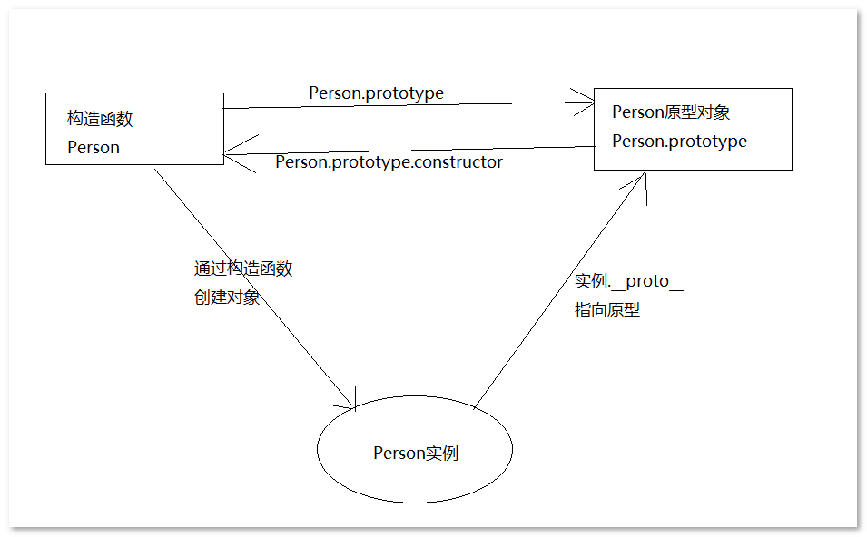

# JavaScript高级

本阶段目标

- 理解面向对象开发思想
- 掌握JavaScript面向对象开发相关模式
- 掌握在JavaScript中使用正则表达式

JavaScript的组成

- ECMAScript
- Web APIs
  - BOM
  - DOM

## 浏览器是如何工作的


```
User Interface  用户界面，我们所看到的浏览器
Browser engine  浏览器引擎，用来查询和操作渲染引擎
*Rendering engine 用来显示请求的内容，负责解析HTML、CSS，并把解析的内容显示出来
Networking   网络，负责发送网络请求
*JavaScript Interpreter(解析者)   JavaScript解析器，负责执行JavaScript的代码
UI Backend   UI后端，用来绘制类似组合框和弹出窗口
Data Persistence(持久化)  数据持久化，数据存储  cookie、HTML5中的sessionStorage
```

## JavaScript面向对象编程

### 面向对象介绍

#### 什么是对象

- 单个事物的抽象
- 封装了属性（property）和方法（method）的容器

ECMAScript-262 把对象定义为： **无序属性的集合，其属性可以包括基本值、对象或函数。**

#### 面向对象与面向过程的区别

- 面向过程就是亲力亲为，事无巨细，面面俱到，步步紧跟，有条不紊
- 面向对象就是找一个对象，指挥得结果
- 面向对象将执行者转变成指挥者
- 面向对象不是面向过程的替代，而是面向过程的封装

#### 面向对象的特性

- 封装性 
- 继承性
- [多态性]抽象

### 构造函数

```js
function Person (name, age) {
  this.name = name
  this.age = age
  this.sayName = function () {
    console.log(this.name)
  }
}
```

#### 构造函数代码执行过程

1. 创建一个新对象
2. 将构造函数的作用域赋给新对象（因此 this 就指向了这个新对象）
3. 执行构造函数中的代码
4. 返回新对象

下面是具体的伪代码：

```js
function Person (name, age) {
  // 当使用 new 操作符调用 Person() 的时候，实际上这里会先创建一个对象
  // var instance = {}
  // 然后让内部的 this 指向 instance 对象
  // this = instance
  // 接下来所有针对 this 的操作实际上操作的就是 instance

  this.name = name
  this.age = age
  this.sayName = function () {
    console.log(this.name)
  }

  // 在函数的结尾处会将 this 返回，也就是 instance
  // return this
}
```

#### 构造函数和实例对象的关系

使用构造函数的好处是**可以识别对象的具体类型** 。

- 实例的 **constructor** 属性
- **instanceof** 操作符

```js
var person1 = new Person('zs', 12)
console.log(person1.constructor === Person)  // true
console.log(person1 instanceof Person)  // true
```

#### 构造函数的问题

浪费空间： 每个实例对象都会保存共有的方法和一些可以共享的变量。

较好的解决方案是使用原型（prototype）。

### 原型 - prototype

JavaScript 规定，每一个构造函数都有一个 `prototype` 属性，指向另一个对象。
这个对象的所有属性和方法，都会被构造函数的所拥有。

这也就意味着，可以把所有对象实例需要共享的属性和方法直接定义在 `prototype` 对象上。

```javascript
function Person (name, age) {
  this.name = name
  this.age = age
}

Person.prototype.type = 'human'

Person.prototype.sayName = function () {
  console.log(this.name)
}

var p1 = new Person(...)
var p2 = new Person(...)

console.log(p1.sayName === p2.sayName) // => true
```

这时所有实例的 `type` 属性和 `sayName()` 方法，
其实都是同一个内存地址，指向 `prototype` 对象，因此就提高了运行效率。

#### 构造函数、实例、原型的关系



总结：

- 任何函数都具有一个 `prototype` 属性，该属性是一个对象

- 构造函数的 `prototype` 对象默认都有一个 `constructor` 属性，指向 `prototype` 对象所在函数

- 通过构造函数得到的实例对象内部会包含一个指向构造函数的 `prototype` 对象的指针 `__proto__`

  > 注意： `__proto__` 是非标准属性

- 所有实例都直接或间接继承了原型对象的成员

#### 属性成员的搜索原则：原型链

每当代码读取某个对象的某个属性时：

- 先在实例对象自己身上找，找到即返回
- 自己身上找不到，则沿着原型链向上查找，找到即返回
- 如果一直到原型链的末端还没有找到，则返回 `undefined`

#### 实例对象修改原型对象的成员

**值类型成员写入（`实例对象.值类型成员 = xx`）**：

- 当实例期望重写原型对象中的某个普通数据成员时实际上会把该成员添加到自己身上
- 也就是说该行为实际上会屏蔽掉对原型对象成员的访问

**引用类型成员写入（`实例对象.引用类型成员 = xx`）**：

- 同上

**复杂类型修改（`实例对象.成员.xx = xx`）**：

- 同样会先在自己身上找该成员，如果自己身上找到则直接修改
- 如果自己身上找不到，则沿着原型链继续查找，**如果找到则修改**
- 如果一直到原型链的末端还没有找到该成员，则报错

#### 更简单的原型语法写法

用一个包含所有属性和方法的对象字面量来重写整个原型对象：

```js
function Person (name, age) {
  this.name = name
  this.age = age
}

Person.prototype = {
  constructor: Person, // => 手动将 constructor 指向正确的构造函数
  type: 'human',
  sayHello: function () {
    console.log('我叫' + this.name + '，我今年' + this.age + '岁了')
  }
}
```

>  为了保持 `constructor` 的指向正确，手动赋值。

#### 原型对象使用建议

- 私有成员（一般就是非函数成员）放到构造函数中
- 共享成员（一般就是函数）放到原型对象中
- 如果重置了 `prototype` 记得修正 `constructor` 的指向

#### 案例

[随机方块](assets/随机方块案例/index.html)

