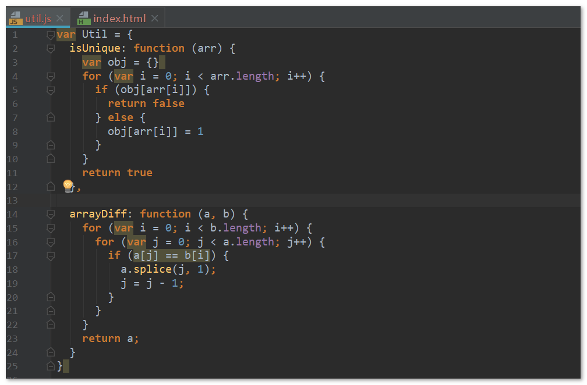

# 贪吃蛇游戏总结

## 项目目录结构

 

[游戏链接](assets/贪吃蛇案例/index.html)


## 编程注意点

### 每个类分为一个js文件

如项目结构图所示

### js文件的引用关系

 

### 公用代码

放在一个单独的js文件中，如这里的`util.js`



### 避免命名冲突

为了避免各个js文件中全局变量的命名冲突，每个js文件需要有一个**单独的作用域**，解决方法是 **使用自调用函数** ，示例格式如下：

```js
// Food.js

// 创建自调用函数，开启新的作用域，避免命名冲突
;(function (){
    var a = 1, b = 2
    function fn(){}
    
    function Food(){
        // some code...
    }
    
    window.Food = Food  // 不能忘记这句代码，将Food绑定到顶级对象window上
})()
```

这样，Food.js中的 `a, b, fn` 就不会被外部访问到了。

### bind()

bind()可以**改变方法中的this的指向**，并返回一个新函数。

示例：

```js
var a =123
var obj = {a: 456}

var fn = function (){
    console.log(this.a)   // --------  this指向window
}

fn()  // 123

var fn2 = fn.bind(obj)

fn2()  // 456    -----------   fn.bind(obj) 让方法中的this指向了obj，返回一个新函数给fn2
```

### 自调用函数的问题

**问题场景**

```js
// 情景1, 多个自调用函数
(function (){ 
    console.log(1) 
})()

(function (){ 
    console.log(2) 
})()

```

由于两个自调用函数之间没有 ";" ,导致解析器将第二个自调用函数的定义作为参数传给第一个函数。
```js
// 情景2， 函数和自调用函数一起
var fn = function (){
    console.log(1)
}

(function (){ 
    console.log(2) 
})()
```

由于函数表达式没有加 ";"， 导致自调用函数的定义作为参数传给了第一个函数。

**解决方法**

在每个自调用函数之前加上 `;` 。

```js
;(function (){
    console.log(1)
})

;(function (){
    console.log(2)
})
```

### 自调用函数的参数 - window和undefined

```js
;(function (window, undefined){
    // some code...
    console.log(window)
})(window)
```

**传入window对象的意义：**

- 提高效率 - `window` 对象不作为参数传入同样可以访问到，因为`window`是全局变量；但是传入 `window` 后，函数内部的 `window` 可以从当前作用域中查找到`window`对象，不必到全局作用域查找 `window` 。

- 方便代码压缩 - 压缩代码时，形参和函数内部的 `window` 可以被压缩，类似如下：

  ```js
  ;(function (w, undefined){
      console.log(w)
  })(window)
  ```

**形参undefined的意义：**

早期的浏览器，undefined可以被赋值:

```js
undefined = 1
console.log(undefined)  // 1, 现在的浏览器为undefined ，不可以赋值
```

由于实参没有第二个参数，所以形参中的`undefined`接收的就是`undefined`，这样即使外部将 `undefined`重新赋值也不会影响到函数内部。

IE8控制台实验截图：

 

## 代码发布前的工作

### js代码压缩

- 将几个js文件合并成一个, 如 `index.js` 【注意引用关系】
- 在线代码压缩  - [在线js代码压缩链接](http://tool.oschina.net/jscompress) , 获得 `index.min.js`

