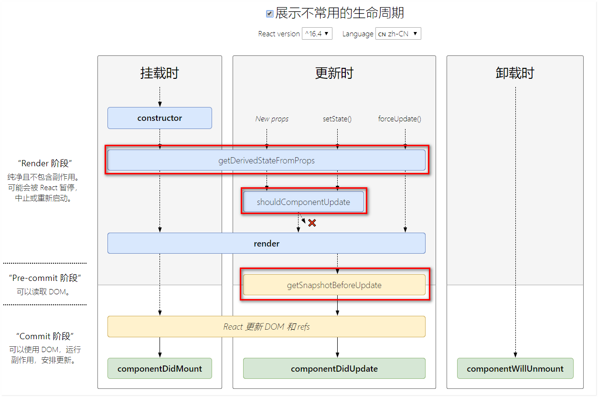

# React.js

## React起源
起源于Facebook内部项目，起初用于架设Instagram网站，**2013年5月开源**。  

## React核心概念

### 虚拟DOM（Virtual Document Object Model）

#### 为什么需要虚拟DOM
- 存在问题： 有些情况下少部分数据的更改，会导致整个DOM树的重绘、重排，性能浪费严重
- 解决思路： 实现DOM的按需更新，只把需要更新的元素重新构建，其它元素不更新
  - 如何实现按需更新： 获取页面更新前后的两棵DOM树，对比两棵DOM树，找到需要重新构建的元素即可
    - 如何获取内存中的DOM树： 浏览器没有提供相关API，只能自己来模拟这两棵新旧DOM树。  

#### 虚拟DOM的本质和作用
虚拟DOM的本质： 使用JS来模拟DOM树，  
虚拟DOM的作用： 实现DOM节点的高效更新。  

### Diff算法
- tree diff：
  - 新旧DOM树逐层对比
- component diff：
  - 逐层对比时每个组件间的对比
- element diff：
  - 组件中每个元素间的对比
- key：
  - 最简单的对比方式，key属性可以将DOM节点和虚拟DOM中的对象关联起来  

  

## React的使用

### 1.基本使用
1. 安装 React 和 ReactDOM 
   ```sh
   yarn add react react-dom
   ```  

2. 创建DOM元素
   不能直接手写HTML代码，而是使用React提供的API来创建。  
   `React.createElement(type[, props[, ...children]])` 用于创建虚拟DOM对象，参数说明：  
   - type: 必填，需要创建的HTML元素
   - props: 可选，元素的属性
   - ...children: 可选，元素的子元素  
  
   示例：  
   ```js
   import React from 'react'
   import ReactDOM from 'react-dom'

   var myH1 = React.createElement('h1', null, 'this is myH1')
   var myDiv = React.createElement('div', { style: { backgroundColor: 'red' }}, 'this is myDiv', myH1)
   ```

3. 渲染虚拟DOM元素到页面中的容器中
   `ReactDOM.render(vnode, container)` 用于将虚拟DOM对象渲染到指定的容器中，参数说明：  
   - vnode： 虚拟DOM节点
   - container： 页面中的容器（注意是 DOM element 而不是 id）
   
   示例：  
   ```js
   ReactDOM.render(myDiv, document.querySelector('#app'))
   ```  

### 2.JSX语法
使用 `React.createElement` 创建元素，书写不方便且不能直观地看出DOM结构，于是就有了JSX语法，JSX语法是指符合XML规范的JS写法。  
> JSX只是一个语法糖，最终还是转换成 `React.createElement` 来实现。  

JSX语法示例：  
```jsx
var myDiv = <div>这是使用JSX语法创建的div</div>
```

#### 安装JSX语法转换工具
要想使用JSX语法，还需要安装JSX语法转换工具 `@babel/preset-react`：  

```sh
yarn add @babel/preset-react -D
```  

然后在 `babel` 配置文件中 `presets` 中添加 `@babel/preset-react`。  

#### JSX基本语法
1. JSX中遇到 `<>` 则当作HTML来处理，遇到 `{}` 则当作JS来处理，`{}` 内可以写任何符合JS规范的代码；
2. JSX中如果要为元素添加 `class` 属性需要写成 `className`，类似还有 `for` 写成 `htmlFor` （使用JS创建元素也是如此写法）；
3. JSX中style写法： `style={ {color: 'red'} }`，外层花括号代表写JS，内层花括号代表传入一个对象；  
4. JSX中必须有唯一的根元素包裹；
5. JSX中的注释写法： `{/* this is comment */}`。  

> 在js文件中书写JSX语法智能提示不全，将文件名改为 `.jsx` 后缀名即可。

### 3.React组件
在React中，构造函数就是一个最基本的组件，函数名称就是组件的名称，以HTML标签的形式书写即可引入该组件：  
```jsx
function Hello(){
  return <div>hello World</div>
}

ReactDOM.render(<Hello />, document.querySelector('#app'))
```  
> 注意：  
> React解析标签时，如果是大写字母开头，则按照组件的形式去解析，如果是小写字母开头，则当作普通HTML标签处理。  
> 所以React中**组件首字母必须为大写**。  

### 3.1组件传值及获取
向组件传值通过属性的方式：  

```jsx
var myDiv = <div><Hello name='world'/></div>
```  

组件内部获取属性通过构造函数的第一个参数 `props`：  

```jsx
function Hello(props){
  return <h2>Hello {props.name}</h2>
}
```  

### 3.2class定义组件
1. 继承 `React.Component`:    
2. 实现 `render` 方法：  

```jsx
class App extends React.Component {

  constructor(){  
    super()   // class语法规定：派生类如果显示声明了constructor()，则必须先调用super()方法
    // ...
  }

  render (){
    return <div>App.jsx</div>
  }

}
```  
> class定义的组件中获取属性传的值： 直接使用 `this.props.属性名` 的方式获取，在 `constructor` 中第一个参数即为 `props` 。  

### 3.3有状态组件和无状态组件
使用class定义的组件是有状态组件，组件内部有生命周期和状态 `state`；  
使用构造函数定义的组件是无状态组件，组件没有生命周期和状态。  


### 3.4组件中样式的书写
1. 行内样式：
   行内样式书写使用 `style` 属性，但是JSX中 `style` 需要传入对象而不是字符串：  
   ```jsx
   function Hello(){
     return <h1 style={ {margin: 0, color: 'red'} }>Hello React.js</h1>
   }
   ```  
   行内样式还可以抽离成单独的对象：  
   ```jsx
   const inlineStyle = {
     h1: {
       margin: 0,
       color: 'red'
     }
   }

   function Hello(){
     return <h1 style={inlineStyle.h1}>Hello React.js</h1>
   }
   ```  

2. 单独的样式文件：  
   引入单独的样式文件，使用类名定义样式：  
   ```jsx
   import './style.css'

   function Hello(){
     return <h1 className=".title">Hello React.js</h1>
   }
   ```  
   这样引入单独样式文件存在的问题：类名是全局的，  
   解决方法： 启用**CSS模块化** ：  
   ```js
   {
     test: /\.(css|scss)$/,
     use: [
       'style-loader',
        {
          loader: 'css-loader',
          options: {
            modules: true  // 开启模块化
          }
        },
        'sass-loader'
     ]
   }
   ```  
   这样只配置 `modules: true` 的方式，会生成hash类名保证类名唯一，但是可读性很差，可以自定义类名生成方式：  

   ```js
   options: {
     modules: {
      // mode: 'local',  // mode 默认为 'local'，可省略
      localIdentName: '[name]__[local]_[hash:8]'  // 自定义类名生成方式， 文件名__类名_hash:8
     }
   }
   ```  

   然后引入样式文件时，使用变量接收：  

   ```jsx
   import styles from './style.css'

   function Hello(){
     return <h1 className={styles.title}>CmtList Demo</h1>
   }

   ```  

   效果如图：  
     

   开启模块化之后，由于 mode 设置为了 `'local'`，所以样式都默认修改类名，如果想要定义全局样式，不想样式名被修改，使用 `:global(样式名)` 来定义：  

   ```css
   :global(.title) {
     color: lightgreen;
   }
   ```  

### 4.react生命周期
React常用生命周期可以分为三个阶段：创建阶段、运行阶段和销毁阶段，每个阶段都有一些钩子函数。   

#### 4.1React常用生命周期函数
[React生命周期函数在线查看](http://projects.wojtekmaj.pl/react-lifecycle-methods-diagram/)  

  

创建阶段：  
|  函数  | 说明 |  
| -------- | -------- |  
| constructor | 构造函数 |  
| render | 渲染虚拟DOM |  
| componentDidMount | 组件已经挂载到页面上后触发 |  

> 注意：render函数只负责创建并返回虚拟DOM树，render完成之后React才更新DOM和refs。

运行阶段：  
| 函数 | 说明 |  
| ---- | ---- |  
| render | 渲染虚拟DOM |  
| componentDidUpdate | 组件完成更新后触发 |  

销毁阶段：  
| 函数 | 说明 |  
| ---- | --- |  
| componentWillUnmount | 组件即将卸载 |  

#### 4.2React全部生命周期函数
  

除了常用生命周期函数，还有以下三个不常用的生命周期函数：  

| 函数 | 说明 |  
| --- | ---- |  
| getDerivedStateFromProps | 创建阶段和运行阶段的生命周期函数，接收新props、更新state或调用forceUpdate()均会触发 |    
| shouldComponentUpdate | 返回true/false指示是否需要更新组件 |  
| getSnapshotBeforeUpdate | React更新DOM之前触发，可以用来存储一些更新前的DOM信息，而返回值会作为参数传递给 ComponentDidUpdate |  

#### 4.3即将废弃的生命周期函数
React17即将废除的生命周期函数有三个：

| 函数 | 说明 |  
| ---- | ---- |  
| componentWillMount | 组件即将挂载 |  
| componentWillReceiveProps | 组件即将接收新props，与 getDerivedStateFromPorps 的区别是该方法只会在运行阶段触发且不管props是否改变 |  
| componentWillUpdate | 组件即将更新 |  

