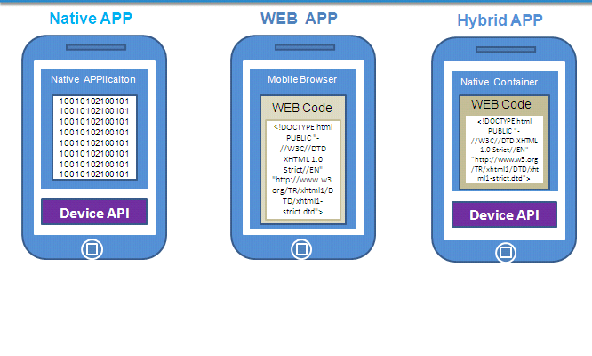

# 混合移动App介绍及开发环境搭建

- [移动App开发相关概念](#移动App开发相关概念)
  - [什么是混合移动App开发](#什么是混合移动App开发)
  - [原生App、WebApp和混合App](#原生AppWebApp和混合App)
- [主流混合App开发技术](#主流混合App开发技术)
  - [主流混合App开发技术之间的区别](#主流混合App开发技术之间的区别)
  - [使用HbuilderX生成安卓App(在线方式)](#使用HbuilderX生成安卓App在线方式)
- [搭建ReactNative开发环境](#搭建ReactNative开发环境)
- [搭建Weex开发环境](#搭建Weex开发环境)

## 移动App开发相关概念
### 什么是混合移动App开发
利用Web开发技术进行移动App开发的方式叫作 `混合移动App开发` 。

### 原生App、WebApp和混合App
原生App（NativeApp）： 使用官方的开发工具和配套的语言进行App开发；  
网页App（WebApp）： 使用Web开发技术开发的基于浏览器的应用；  
混合App（HybridApp）： 使用Web开发技术，配合一些相关的打包编译技术进行App开发。  

  

> 注意： 混合App开发有两种方式：
> - 一种是使用原生容器包裹的网页代码，
> - 另一种是类似ReactNative，打包之后是原生代码。

## 主流混合App开发技术
- html5+
  - 认识[html5+](http://www.html5plus.org/#home): h5+是一个致力于推广H5的产业联盟
  - [HBuilderX](http://www.dcloud.io/hbuilderx.html): 代码编辑器,可以进行App的打包
- Angular.js 和 Ionic
- Vue.js 和 Weex
- React.js 和 ReactNative

> Angular、Vue、React是三大前端框架，在进行混合移动App开发时只是使用到其基本语法；
> Ionic、Weex、ReactNative是相应的打包工具，能够将开发出来的应用最终打包成应用程序。  

### 主流混合App开发技术之间的区别
- html5+ 和 Ionic 
  - 是将web网页打包在一层原生容器中,内部本质是网站;
- ReactNative 和 Weex 
  - 是打包原生性质的App,内部是原生代码.

### 使用HbuilderX生成安卓App(在线方式)
1. 新建  `5+app` 项目,
2. 修改 `manifast.json` 文件, 配置图标等基本信息,
3. 将已有的WebApp项目文件覆盖到该 `5+app` 项目中,
4. 右键 -> `发行` -> `原生app-云打包`, 等待完成即可.

## 搭建ReactNative开发环境
参考[ReactNative中文网](https://reactnative.cn/)进行RN环境搭建.  

## 搭建Weex开发环境
参考ReactNative配置 `Android开发环境`, 其它参考[Weex官网](https://weex.apache.org/zh/guide/develop/setup-develop-environment.html#%E5%AE%89%E8%A3%85%E4%BE%9D%E8%B5%96)