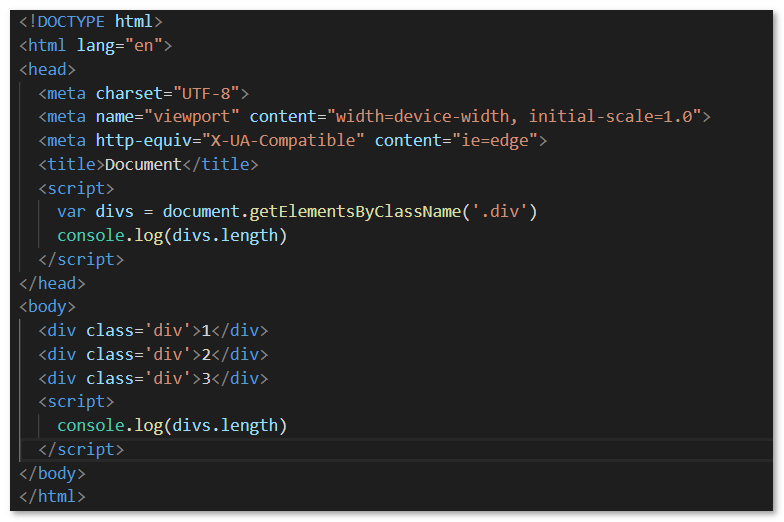

# Web API - part1

## Web API介绍

### API

`Application Programming Interface` ，应用程序编程接口。

### Web API

浏览器提供的一套操作浏览器功能和页面元素的API（BOM和DOM）

> 此处的Web API特指浏览器提供的API，Web API在后续有其他含义。

### JavaScript的组成


**ECMAScript - JavaScript的核心**

定义了JavaScript的语法规范

**BOM - 浏览器对象模型**

操作浏览器功能的API

**DOM - 文档对象模型**

操作页面元素的API

## DOM

### DOM的概念

文档对象模型（Document Object Model，简称DOM），是[W3C](https://baike.baidu.com/item/W3C)组织推荐的处理[可扩展标记语言](https://baike.baidu.com/item/%E5%8F%AF%E6%89%A9%E5%B1%95%E7%BD%AE%E6%A0%87%E8%AF%AD%E8%A8%80)的标准[编程接口](https://baike.baidu.com/item/%E7%BC%96%E7%A8%8B%E6%8E%A5%E5%8F%A3)。

[DOM](https://baike.baidu.com/item/DOM/50288)是一种基于树的[API](https://baike.baidu.com/item/API/10154)文档，它要求在处理过程中整个文档都表示在[存储器](https://baike.baidu.com/item/%E5%AD%98%E5%82%A8%E5%99%A8)中。

### 获取页面元素

**根据id获取元素**

```js
var div = document.getElementsById('main')
console.log(div)
// 获取到的数据类型是 HTMLDivElement
```

**根据标签名获取元素**

```js
var divs = document.getElementsByTagName('div')
```

**根据类名获取元素***

```js
var divs = document.getElementsByClassName('a')
```

> 注意： `getElementsByClassName()` 方法**IE9+**支持。

**根据选择器获取元素**

```js
var text = document.querySelector('#text')

var boxes = document.querySelectorAll('.box')
```

> 注意： `querySelector()` 和 `querySelectorAll()` 方法**IE8+**支持。

### 其它注意点

`getElementsByTagName()` 和 `getElementsByClassName()` 方法是**即时更新**的：



打印结果为：0  3

### 注册事件

1. DOM操作中由于 `class` 是关键字，所以获取/设置元素的**类名**时使用的是 `className` 。

2. 取消 `a` 标签默认的跳转行为（href属性）：点击事件末尾加上`return false` 即可。

3. innerHTML和innerText的区别：

   - 获取内容时：

     innerHTML会原封不动获取元素标签内部内容，包括标签、换行和缩进空格；而innerText会过滤标签，只获取文本，多个连续空格会合并成一个。

   - 设置内容时：

     innerHTML设置内容时，会以HTML的方式来解析；而innerText会原封不动显示为文本。

4. HTML转义符

   ```
   "		&quot;
   '		&apos;
   & 		&amp;
   <		&lt;
   >		&gt;
   空格	   &nbsp;
   ©		&copy;
   ```

5. 兼容性处理 - 判断DOM元素是否具有某个属性

   ```js
   var a = document.getElementById('a')
   console.log(typeof a.id)  // string
   console.log(typeof a.xxx)  // undefined
   
   // 判断浏览器是否支持innerText属性
   if(typeof a.innerText){
       console.log('支持innerText')
   }
   ```

6. 获取/设置/移除DOM元素的**自定义属性**的值

   ```html
   <div id="a" divId="0001">123</div>
   <script>
       var a = document.getElementById('a')
       
       // 错误的获取方式
       console.log(a.divId)  // undefined
       // 正确的获取方式 ------  使用 **getAttribute()** 方法
       console.log(a.getAttribute('divId'))  // '0001'
       
       // 设置自定义属性（或自带属性） ------  使用 **setAttribute()** 方法
       a.setAttribute('sex', 'male')
       
       // 移除自定义属性（或自带属性） ------  使用 **removeAttribute()** 方法
       a.removeAttribute('sex')
   </script>
   ```

### 节点介绍及应用

   DOM中所有内容都是**节点（node）**，节点具有的属性包括：**nodeType（节点类型）**、**nodeName（节点名称）**、**nodeValue（节点值）**。

   节点类型（nodeType）分为：

    - 元素节点 ---- 1
    - 属性节点 ---- 2
    - 文本节点 ---- 3
    - 注释节点 ----  8
    - 文档节点（document） ---- 9

   节点名称（nodeName）分为：

   - 元素节点 ---- 元素名称（大写的）
   - 属性节点 ---- 属性名称
   - 文本节点 ---- 固定是 #text
   - 注释节点 ---- 固定是 #comment
   - 文档节点 ---- 固定是 #document

   节点值（nodeValue）分为：

   - 文本节点的节点值为 包含的文本
   - 属性节点的节点值为 属性值
   - 其它节点的节点值为 null

   **获取父子节点**

   1. 获取父节点： element**.parentNode**
   2. 获取子节点： element**.childNodes**
   3. 获取**子元素**节点： element**.children**

   ```html
   <div id="a">
       <p>hello world</p>
       <span>this is span</span>
       <!-- this is comment -->
   </div>
   <script>
       var div = document.getElementById('a')
       
       console.log(div.childNodes.length)  // 7,包括注释节点和换行缩进产生的文本节点
       
       console.log(div.children.length)  // 2， 只包含元素节点
   </script>
   ```

### 动态创建元素

设置**innerHTML属性**的值时，如果大量的字符串进行拼接，不能直接使用 `+=` 的操作（因为由于字符串的不可变性，会创建很多次字符串对象, 有性能问题），而推荐使用数组存放每个独立的项，最后使用 `join('')` 进行拼接。

**常用的元素操作方法**

```js
1. createElement()
2. appendChild()
3. removeChild()

4. insertBefore(newEle, oldEle)
5. replaceChild(newEle, oldEle)

// 注意： appendChild()中的元素如果已经存在于文档中，则会删除原文档中的该元素，添加到新的位置。如下代码所示：

var ul = document.getElementById('ul')
var li = ul.children[0]
var ul2 = document.getElementById('ul2')
ul2.appendChild(li)  
// 这将会导致ul中第一项从ul中移动到了ul2中，如果不想删除ul中的第一项，可以使用cloneNode()方法复制一个相同的节点：

var newNode = li.cloneNode(true)  // true-深度克隆，克隆所有后代，默认值为false
ul2.appendChild(newNode)
```


