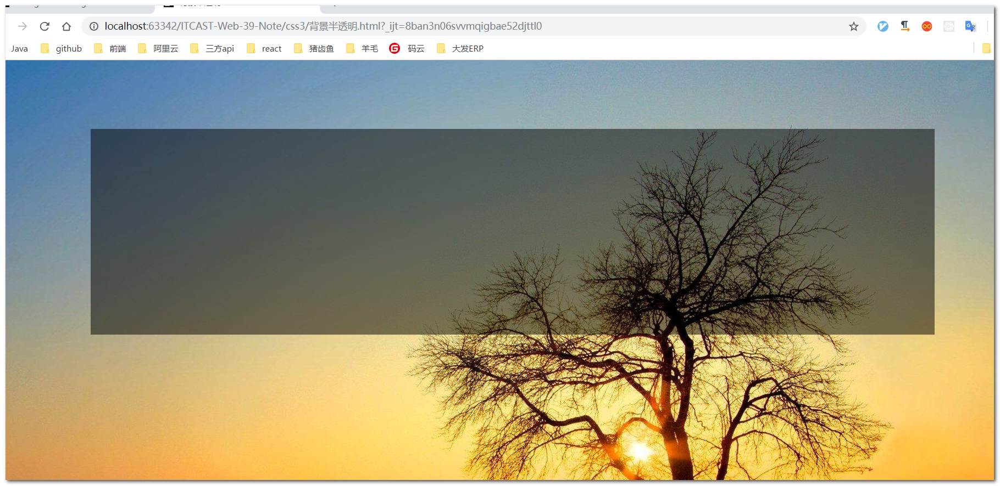
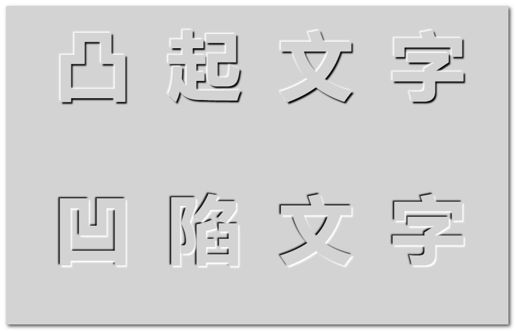

# CSS - part 1

## CSS产生原因

为了拯救html混乱的样式，让html专注于结构呈现，而将样式交给css。

## CSS初识

CSS： 层叠样式表（Cascading Style Sheet）。

## 字体字号设置

- 网页普遍使用14+的字号，字号最好为偶数。
- `font-family` 支持多个字体，按顺序匹配。

  ~~~css
  font-family: "Microsoft Yahei",arial,tahoma;
  ~~~

## 字体加粗

`font-weight`  属性。

取值： 100 - 900 之间的整百值【提倡使用数字】。

- normal - 400
- bold - 700

> `strong` 标签也可以加粗字体。

## 字体倾斜

`font-style` 属性。

取值：

- normal - 正常
- italic - 斜体

> `em` 标签也可以倾斜字体。

## 链接伪类选择器

- link - 链接未点击状态
- visited - 链接已点击过后的状态
- hover - 链接鼠标悬浮状态
- active - 链接激活状态（鼠标点击未松开时）

> 注意顺序不要乱： **love hate原则**。

实际工作中一般只需要 普通状态和hover状态，即：

~~~css
a {
  color: red;
}
a:hover {
  color: green;
}
~~~

## 结构伪类选择器

- :first-child - 结构上处于第一个的子元素 
- :last-child - 结构上处于最后一个的子元素
- :nth-child(n) - 结构上处于第n个的元素，其中n可以为公式，如 `nth-child(2n-1)`  选取的是所有奇数元素， `nth-child(-n+4)` 选中前4个。
- :nth-last-child(n) - 结构上处于倒数第n个的元素

> 注意 `E:first-child` 与 `E:first-of-type` 的区别：
>
> `E:first-of-type` 是选中子元素中第一个E元素，而不要求E元素位置在第一个；
>
> `E:first-child` 是当父元素第一个位置的元素，且该元素类型为E时才选中。

## 目标伪类选择器

- :target - 当前选中id的目标元素

~~~css
:target {
    color: red;
}
~~~

## 首行缩进

- text-indent - 一般使用 `em` 做单位，`2em` 即首行缩进2个字符。

## 字间距和单词间距

- letter-spacing - 字间距
- word-spacing - 单词间距（只针对英文，英文才有单词）

## 颜色半透明

- rgba(r, g, b, a) - a 是 `alpha` ，透明的意思，取值 0 - 1 之间。

## 文字阴影

text-shadow - 文字阴影

参数：

- h-offset- 水平方向偏移量 【必须，可为负值】
- v-offset- 垂直方向偏移量【必须，可为负值】
- blur - 模糊度
- color - 阴影的颜色

示例：

~~~css
p {
    text-shadow: 20px -16px 6px #333;
}
~~~

> 可以同时设置多个文字阴影，见最后的示例。

## 样式表

外部样式表写法：

```html
<link type="text/css" rel="stylesheet" href="style.css"/>
```

## 块级元素和行内元素

**块级元素**

- 独占一行
- 宽度默认100%
- 高度、行高、外边距、内边距可控制
- 可以容纳任何元素【p、h1、dt等之类的文字型块级元素不符合】

**行内元素**

- 和相邻行内元素处于一行上
- 宽、高无效，但水平方向padding和margin可以设置 
- 默认宽度为元素本身内容的宽度
- 只能容纳行内元素和文本【a 元素不符合】

**行内块元素（inline-block）**

- 和相邻行内元素或行内块元素处于一行上【但是需要注意**行内块元素之间会默认有缝隙**】
- 默认宽度为本身内容宽度
- 高度、宽度、外边距、内边距可以控制

> 三个显示模式之间的切换： `display：block/inline/inline-block` 。

## 属性选择器

| 选择器         | 含义                         |
| -------------- | ---------------------------- |
| E[attr]        | 选中存在attr属性的E元素      |
| E[attr="val"]  | 选中attr属性为val的E元素     |
| E[attr*="val"] | 选中attr属性中包含val的E元素 |
| E[attr^="val"] | 选中attr属性以val开头的E元素 |
| E[attr$="val"] | 选中attr属性以val结尾的E元素 |

## 伪元素选择器

- ::first-letter - 选中首个字（母）
- ::first-line - 选中首行
- ::selection - 选中的内容


- ::before - 元素内部的最前面
- ::after - 元素内部的最后面

> 伪元素可以加在伪类后面，类似 `div:hover::before` 这样的写法是有效的。

## CSS书写规范【非强制】

- 选择器与 `{` 之间必须包含空格。 示例： `.class {}`

- 属性名与之后的 `:` 之间不允许包含空格，`:` 与之后的属性值之间必须有空格。示例：`font-size: 12px;` 

- 并集选择器中每个选择器独占一行。示例：

  ```css
  div,
  span,
  p {
      font-size: 12px;
  }
  ```

## 背景设置

**背景图片**

 `background-image: url("images/demo.jpg")` 

**背景重复**

`background-repeat`， 默认 `repeat`

**背景位置**

 `background-position` ，值的写法：

- length - 如 `background-position: 20px 10px;` 代表背景图片**距离左边20px,上边10px**；
- position - 如 `background-position: right bottom;` 代表背景图片位于右下位置；
- 混搭length和position - 如 `background-position: center 20px;` 代表背景图片水平居中，垂直方向距离顶部20px。

**背景图片附着（固定）**

`background-attachment` , 默认值为 `scroll` 。

- scroll - 背景图片随内容滚动；
- fixed - 背景图片相对于**浏览器可视区域**固定。

**背景简写**

`background: 背景颜色 背景图片 重复 附着 位置`, 可以不全写。

示例：

```css
body {
    background：url(images/demo.jpg) no-repeat center 100px;
}
```

**背景半透明**

`background-color: rgba(0,0,0,.3)` 

效果如图：



**背景图片尺寸**

`background-size`  ,可选值：

- length - 单位px或%，如 `background-size: 400px 300px;` ,【最好只设置一个值，防止失真】
- cover - 保证覆盖整个容器
- contain - 保证整个背景图片完全显示

**多图片背景**

`background` 可以同时指定多个背景图，多个背景图以**逗号分隔**，如果重合，**先写的会覆盖后写的**，并且**背景颜色只能加在最后一个背景图上。**

示例：

```css
body {
    background: url(image.jpg) no-repeat top left,
                url(image.jpg) no-repeat top right,
                url(image.jpg) no-repeat bottom left pink;
}
```

- 文字背景 `text-shadow` 也可以指定多个。可以做凸起凹陷文字效果：



```css
p.tuqi {
    text-shadow: -2px -2px 2px #fff,  2px 2px 2px #000;
}
p.aoxian {
    text-shadow: 2px 2px 2px #fff, -2px -2px 2px #000;
}
```

