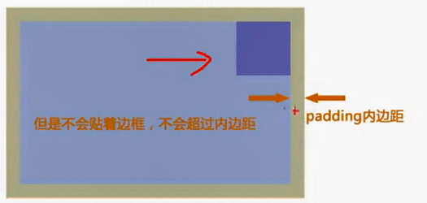

# CSS - part 2

## CSS 三大特性

层叠、继承、优先级。

**层叠性**

指多种CSS样式的叠加。一般情况下，后面的样式覆盖前面的样式。

**继承性**

子元素可以继承父元素的某些样式。【基本都是与文字相关的样式，如字体，字号，颜色，**行高**等】

**优先级**

CSS特殊性（Specificity）：衡量CSS值优先级的标准。

| 类型                                         | 贡献值       |
| -------------------------------------------- | ------------ |
| 继承 / *                                     | 0,0,0,0      |
| 标签选择器                                   | 0,0,0,1      |
| 类选择器/ 伪类选择器/属性选择器/伪元素选择器 | 0,0,1,0      |
| ID选择器                                     | 0,1,0,0      |
| 行内样式                                     | 1,0,0,0      |
| !important                                   | ∞ （无穷大） |

例如：

```css
a:hover     --->    0,0,1,1
```

> 注意：
>
> 1. 数位之间没有进制关系。
> 2. 首先要判断是否是继承的样式，继承的样式权重为0。

## CSS 边框

**边框样式**

常用属性值： none, solid, dashed, dotted, **double(双实线)**。

## 表格边框变细

使用 `border-collapse: collapse` 将边框合并。

## margin塌陷问题

**相邻块级元素之间垂直方向的外边距合并**

 

解决方法：避免就好了。

**嵌套关系的块级元素间垂直方向的外边距合并**

 

解决方法：避免子元素垂直方向margin，用父元素padding代替；或者父元素设置 `overflow：hidden` 。

## padding不会撑开盒子的情况（重要）

如果指定了盒子的宽度，则再添加padding之后，盒子会被撑开；

但是如果不指定盒子的宽度，宽度由继承而来，此时添加padding则不会撑开盒子。

 

## 盒子模型布局稳定性

优先使用 width （宽度剩余法/高度剩余法）；

其次使用padding；

最后考虑使用margin。

## CSS3盒模型

CSS3中可以通过 `box-sizing` 指定盒模型

- content-box - （默认值）盒子实际占位宽度为width + padding + border
- border-box - 盒子实际占位宽度即为width，即padding和border包含在width里面

## 盒子阴影

`box-shadow` 指定盒子阴影。

语法格式：

```css
box-shadow: h-offset v-offset blur spread color inset;
```

- h-offset - 必须， 水平偏移量
- v-offset - 必须， 垂直偏移量
- blur - 可选，模糊程度
- **spread** - 可选，阴影大小，如 10px
- color- 可选，阴影颜色
- inset - 可选，将外阴影改成内阴影【但是默认的外阴影不能写outset】

> 注：内外阴影可以同时设置，如：

```css
box-shadow: 10px 10px 12px 15px rgba(255,255,255,.2) inset,
            10px 6px 15px -7px rgba(0,0,0,.5);
```

## CSS定位机制

三种：标准流、 浮动、 定位。

### 浮动（float）

**浮动脱离标准流**，不占位置。

float 可选参数： none(默认)、left、right。

**浮动首先要创建一个包裹盒子，在包裹盒子中进行浮动**

**浮动的元素不会压住父元素的padding**

 

**浮动的元素如果没有宽度，会转换成行内块模式，宽度由内容宽度决定**

#### 清除浮动
本质：解决父级元素由于子级元素浮动导致的高度为0的问题。

- 额外标签法 - 父盒子末尾加上一个空 div,对该div清除浮动 `clear: both;`

- `overflow: hidden;` - 会触发BFC，而BFC可以清除浮动

- `::after` 伪元素清除浮动【额外标签法的升级版】

  ```css
  .clearfix::after {
      content: "";
      display: block;
      clear: both;
  }
  ```

- 双伪元素清除浮动

  ```css
  .clearfix:before,
  .clearfix:after {
      content: "";
      display: table;
  }
  .clearfix:after {
      clear: both;
  }
  .clearfix{ /* ie6,7识别 */
      *zoom: 1;
  }
  ```


### 定位（position）

position, 属性值：

- static - 自动定位（默认定位方式）
- relative - 相对定位，相对于该元素在文档流中的位置进行定位
- absolute - 绝对定位，相对于上一个已定位的父元素进行定位
- fixed - 固定定位，相对于浏览器窗口进行定位

> 自动定位（static）可以用来清除定位；
>
> 相对定位（relative）不脱标；
>
> 绝对定位（absolute）、固定定位（fixed）脱标。

**绝对定位的元素不管父元素的padding，只以左上角为基准。**

**绝对定位和固定定位导致元素脱标，跟浮动一样，也会转换模式为行内块元素，宽度由内容宽度决定**

> 总结： 浮动、绝对定位、固定定位的**行内元素**无需手动转换显示模式 `display`，可以直接给宽高。

## 可见性visibility

visibility, 控制元素是否可见，会保留元素在文档流中的位置。属性值：

- visible  - 可见
- hidden - 隐藏

## overflow 溢出

- visible - （默认）不添加滚动条也不隐藏溢出的内容 
- auto - 自动添加滚动条
- scroll - 一直存在滚动条
- hidden - 溢出隐藏

