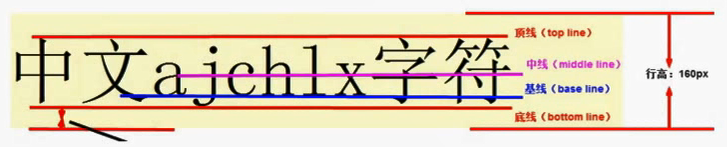

# CSS - part3

## 鼠标样式

`cursor` 属性，属性值：

- default - 默认箭头样式
- pointer - 小手样式
- move - 移动样式（四个方向的箭头）
- text - 输入光标样式

## 轮廓线

`outline` 属性，一般情况都是去掉轮廓线 - `outline: 0;`

分为：outline-width, outline-style, outline-color。

## 禁止文本域改变大小

```css
textarea {
    resize: none; /* 也可以只允许垂直方向改变尺寸 - resize: vertical; */
}
```

## vertical-align垂直居中

vertical-align 只能设置行内、行内块元素的垂直居中对齐（例如 `img`、`textarea`），**对块级元素没有效果**。

对齐方式：`vertical-align: baseline | top | middle | bottom ;`

默认： baseline。



**去除图片底部缝隙**

现象： `img` 标签独占一行时，图片底部和父盒子之间会出现缝隙。

原因： `img` 属于行内块级元素，垂直对齐方式默认baseline，所以，下方会出现空隙。

解决方案：

1. 给 `img` 添加 `vertical-align: top;` ；
2. 或者将 `img` 转为块级元素 `display: block;` 。

## 超出内容以省略号显示

### 英文单词超出容器时换行显示

**1. word-break**

适用于英文单词，指定换行时单词断开方式

- normal - 【默认】使用浏览器默认规则

- break-all - 可以从单词中间断开换行
- keep-all - 不允许拆开单词，只能在半角空格或者连字符处换行

**2. word-wrap**

适用于英文单词，指定长单词的断开方式

- normal - 【默认】使用浏览器默认规则

- break-word - 如果出现长单词在容器末尾放不下，**首先换行**，如果换行后一整行都放不下则断开该单词

> word-break: break-all; 和 word-wrap: break-word; 区别：
>
> word-break: break-all;  - 只要长单词在容器末尾放不下，就断开该单词；
>
> word-wrap: break-word; - 如果长单词在容器末尾放不下，首先 **先换行保证单词完整** ，如果一整行都显示不下该单词，则断开该单词显示不下的部分到新的一行。

### white-space

指定段落是否强制一行内显示

- normal - 默认处理方式
- nowrap - 强制一行显示，除非遇到 `<br />`

### text-overflow 文字溢出

text-overflow 指定段落的文字溢出处理方式，属性值：

- clip  - 直接去除溢出的文字
- ellipsis - 显示省略号【该属性必须配合`overflow:hidden;` 及 `white-space: nowrap;` 才可以生效】

**溢出文字以省略号显示**

```css
div {
    overflow: hidden; /* 指定溢出隐藏 */
    white-space: nowrap; /* 强制一行显示 */
    text-overflow: ellipsis; /* 省略号显示溢出文字 */
}
```

## CSS精灵技术（sprite）

减少访问请求次数，适用于背景图。

逐渐被字体图标取代。

## 字体图标

优势： 可以任意放大缩小、产生阴影、透明效果，修改颜色等。

参考网址：[icomoon](https://icomoon.io/app/#/select)

使用方法：

- 将解压后的文件夹中的 `fonts` 文件夹 和 `style.css` 文件复制到自己的项目中，
- 项目中使用 `class="icon icon-XXX" ` 即可看到效果。

追加新字体图标：

- 将之前下载的压缩包中的 `selection.json` 文件导入到icomoon网站中即可。

> icomoon下载的字体图标文件不要删除，追加字体图标到现有库时需要使用。

## CSS滑动门技术

为了使背景能够自适应元素中文本内容的多少而产生的技术，常见于各种导航栏处。

**核心技术**

```html
<li>
    <a href="#">
        <span>导航栏中的文字</span>
    </a>
</li>
```

1. a标签显示背景的左侧，padding-left撑开合适的宽度；
2. span标签显示背景的右侧，padding-right撑开合适的宽度；
3. 之所以用a包含span，就是因为整个导航菜单项都必须可点击。

**滑动门示例：微信导航栏**


## 过渡效果

transition： 要过渡的属性 花费时间 运动曲线  延时。

| 属性                       | 含义                   |
| -------------------------- | ---------------------- |
| transition                 | 简写版，定义过渡效果   |
| transition-property        | 要过渡的属性           |
| transition-duration        | 过渡花费的时间         |
| transition-timing-function | 过渡曲线，默认：“ease” |
| transition-delay           | 何时开始，延时         |

运动曲线：


**多个属性需要过渡效果:**
- 使用逗号分隔，类似 `text-shadow` ;
- 全部属性需要过渡可以使用 `all` 。

