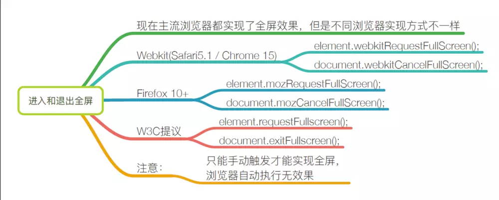

# 	H5 新 API

## 网络状态

- `window.navigator.onLine` 可以检测当前用户网络状态；
- `window.online`  和 `window.offline` 事件在网络连接/断开时触发。

> `online`和`offline`事件必须用 `addEventListener` 方式注册才有效，另外 火狐浏览器 这两个事件始终无效，原因未知。

## 全屏



> 注意:  webkit 和 moz 的方法中 **s** 是大写 。
>
> 另外，IE11浏览器下的方法是 `msRequestFullscreen` \ `msExitFullscreen`。**[10及以下不支持全屏API]**

可以使用 [fscreen](https://github.com/rafrex/fscreen) 库来解决兼容性问题.

### 兼容写法

```js
function requestFullScreen(node){
    if(node.requestFullscreen){
        node.requestFullscreen()
    }else if(node.webkitRequestFullScreen){
        node.webkitRequestFullScreen()
    }else if(node.mozRequestFullScreen){
        node.mozRequestFullScreen()
    }else if(node.msRequestFullscreen){
        node.msRequestFullscreen()
    }else{
        alert('full screen is not supported')
    }
}

function cancelFullScreen(){
    if(document.exitFullscreen){
        document.exitFullscreen()
    }else if(document.webkitCancelFullScreen){
        document.webkitCancelFullScreen()
    }else if(document.mozCancelFullScreen){
        document.mozCancelFullScreen()
    }else if(document.msExitFullscreen){
        document.msExitFullscreen()
    }else{
        alert('exit full screen is not supported')
    }
}

function isFullScreen(){
    fsEle = document.fullscreenElement || document.webkitFullscreenElement ||
        document.mozFullScreenElement || document.msFullscreenElement
    if(fsEle){
        return true
    }else{
        return false
    }
}
```

## 文件读取

HTML5新增内建对象 `FileReader`，可以读取本地文件内容。

- 实例化一个对象
  - `var reader = new FileReader();`

- 实例方法
  1. `readAsDataURL()` 以DataURL形式读取文件
  2. `readAsText()` 以文本形式读取文件

- 事件监听
  - onload 当文读取完成时调用
- 属性
  - `result` - 文件读取结果

示例:

```js
btnUpload.onchange = function (){
    if(this.files.length){
        var fr = new FileReader()
		fr.readAsText(this.files[0], 'gbk')  // 默认编码: utf-8
        fr.onload = function (){
            console.log(this.result)
        }
    }
}
```

## 拖拽事件

在 HTML5 中，拖放是标准的一部分，任何元素都能够拖放。

### 设置元素为可拖动

需要将元素的draggable属性设置为true

> 图片,链接默认可拖拽.

```html
<p draggable="true">this is a para</p>
```

### 拖拽相关API

- 被拖动的对象
  - ondragstart
  - ondrag
  - ondragend
- 接收拖动目标的元素
  - ondragenter
  - ondragover
  - ondrop
  - ondragleave

> 要想触发 `ondrop` 事件, 需要在 `ondragover` 事件中阻止默认行为: `e.preventDefault()` .

### DataTransfer

在**进行拖放操作时**，`DataTransfer` 对象用来保存被拖动的数据。它可以保存一项或多项数据、一种或者多种数据类型.

相关方法:

- setData(type, data)
  - type - 常见的值包括 `text/plain` , `text/html` 等
  - data - 数据
- getData(type) 
- clearData([type])

```js
ele.ondragstart = function (e){
    e.dataTransfer.setData('text/plain', ele.getAttribute('data-dragId'))
}

ele.ondragend = function (e){
    ele.removeAttribute('data-dragId')
    e.dataTransfer.clearData('text/plain')  
}

ele2.ondrop = function (e){
    var id = e.dataTransfer.getData('text/plain')
    this.appendChild(document.getElementById(id))
}
```


## Web存储

随着互联网的快速发展，基于网页的应用越来越普遍，同时也变的越来越复杂，为了满足各种各样的需求，会经常性在本地存储大量的数据，HTML5规范提出了相关解决方案。

### 特性

1、设置、读取方便、页面刷新不丢失数据

2、容量较大，sessionStorage约5M、localStorage约20M

4、只能存储字符串，可以将对象JSON.stringify() 编码后存储

### sessionStorage

1、生命周期为关闭浏览器窗口

2、在同一个窗口(页面)下数据可以共享

### localStorage

1、永久生效，除非手动删除 关闭页面也会存在

2、可以多窗口（页面）共享（同一浏览器可以共享）

### 方法详解

setItem(key, value)  - 设置存储内容

getItem(key) - 读取存储内容

removeItem(key) - 删除键值为key的存储内容

clear() - 清空所有存储内容

## 多媒体自定义控件

方法：load()、play()、pause()

属性：currentSrc、currentTime、duration

事件：oncanplay，  ontimeupdate，onended 等

[**参考文档**](http://www.w3school.com.cn/tags/html_ref_audio_video_dom.asp)

http://www.w3school.com.cn/tags/html_ref_audio_video_dom.asp

