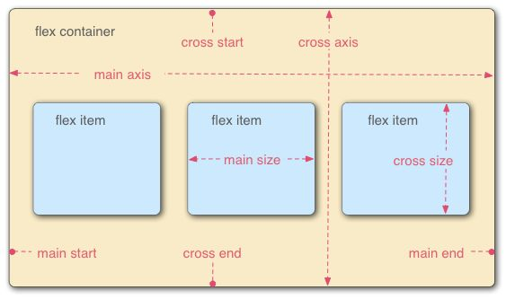

# Flex 布局

- [Flex 基本概念](#flex-基本概念)
- [Flex 容器](#flex-容器)
  - [Flex 容器的属性](#flex-容器的属性)
    - [flex-direction](#flex-direction)
    - [flex-wrap](#flex-wrap)
    - [flex-flow](#flex-flow)
    - [justify-content](#justify-content)
    - [align-items](#align-items)
    - [align-content](#align-content)
- [Flex 单元项](#flex-单元项)
  - [Flex 单元项的属性](#flex-单元项的属性)
    - [order](#order)
    - [flex-basis](#flex-basis)
    - [flex-grow](#flex-grow)
    - [flex-shrink](#flex-shrink)
    - [flex](#flex)
    - [align-self](#align-self)
- [参考文章](#参考文章)

点击查看 [Demo 页面](../assets/flex-demo.html)

## Flex 基本概念



如图所示， `Flex 布局` 由 `container` 和 `item` 配合实现。

- `container` :
  - 容器，存在两条轴 `main axis` 和 `cross axis` （图中是默认的轴线方向）
- `item` :
  - 单元项

## Flex 容器

实现 `Flex 布局` 首先需要指定一个容器 （`container` ），这样容器内部的元素就可以使用 flex 来进行布局：

```css
.container {
  display: flex;
}

.inline-container {
  display: inline-flex;
}
```

分别生成块状或行内的 flex 容器盒子。

> 注意：  
> 当设置成 flex 布局后，子元素的 `float`、 `clear`、 `vertical-align` 属性将会失效。

### Flex 容器的属性

- flex-direction
- flex-wrapper
- flex-flow
- justify-content
- align-items
- align-content

#### flex-direction

指定主轴方向

```css
.container {
  flex-direction: row (default) | column | row-reverse | column-reverse;
}
```

#### flex-wrap

指定容器内的单元项是否可以换行

```css
.container {
  flex-wrap: nowrap (default) | wrap | wrap-reverse;
}
```

- `nowrap`  
  不换行，当主轴尺寸固定时，如果空间不足，则其中单元项的尺寸会随之调整而不会换行
- `wrap`  
  换行，新的一行在下方
- `wrap-reverse`  
  换行，新的一行在上方

#### flex-flow

`flex-direction` 和 `flex-wrap` 的组合写法， 默认值为 `row nowrap`， 分开写就无需记住这个属性了。

```css
.container {
  flex-flow: <flex-direction> || <flex-wrap>;
}
```

#### justify-content

指定单元项在主轴方向上的对齐方式

```css
.container {
  justify-content: flex-start (default) | center | flex-end | space-between |
    space-around;
}
```

#### align-items

指定单元项在交叉轴上的对齐方式

```css
.container {
  align-items: stretch (default) | flex-start | end | flex-end | space-between |
    space-around;
}
```

- `stretch`  
  如果单元项未设置高度或高度设置为 `auto`， 则拉伸至占满整个容器

#### align-content

指定多根交叉轴的对齐方式，如果只有一根交叉轴则不起作用。

```css
.container {
  align-content: stretch (default) | flex-start | center | flex-end |
    space-between | space-around;
}
```

## Flex 单元项

### Flex 单元项的属性

- order
- flex-basis
- flex-grow
- flex-shrink
- flex
- align-self

#### order

指定 flex 单元项的排列顺序， 数值越小越靠前。

```css
.item {
  order: <integer>;
}
```

默认值为 `0`。

#### flex-basis

指定每个 flex 单元项占据的主轴空间， 根据该属性来判断主轴是否有多余空间。

> 注意:  
> 当主轴方向为水平/竖直时，如果设置了 `flex-basis` ， 则 flex 单元项的 `width / hegiht` 将无效。

```css
.item {
  flex-basis: auto (default) | <length>;
}
```

- `auto`
  flex 单元项的大小取决于自身的 `width/height`

#### flex-grow

指定存在剩余空间时， flex 单元项的放大的比例

```css
.item {
  flex-grow: <number>;
}
```

默认值为 `0`，即如果存在剩余空间也不会放大 flex 单元项。

> 1. 对于指定了 `flex-grow` 的 flex 单元项，如果存在剩余空间，则将按照 `flex-grow` 指定的比例将剩余空间分配给各个 flex 单元项;
> 2. 如果不存在剩余空间，则 `flex-grow` 属性没有任何效果。

#### flex-shrink

指定 flex 容器空间不足时， flex 单元项的缩放比例

```css
.item {
  flex-shrink: <number>;
}
```

默认值为 `1`，即如果 flex 容器空间不足，所有 flex 单元项等比例缩放。

> 1. 指定 `flex-shrink: 0;` 的话，则该 flex 单元项不会被缩放。

#### flex

`flex-grow`,`flex-grow`,`flex-shrink` 三个属性的组合写法

```css
.item {
  flex: none | [<flex-grow> <flex-shrink>? || <flex-basis>];
}
```

默认值为三个属性的默认值，即 `0 1 auto`

- `none`
  - 即 `0 0 auto`
- 只指定一个数字
  - 此值为 `flex-grow` 的值，其它属性取默认值
- 只指定一个长度/百分比/auto
  - 此值为 `flex-basis` 的值，其它属性取默认值
- 指定两个数字
  - 此值为 `flex-grow` 和 `flex-shrink` 的值，`flex-basis` 取默认值
- 指定一个数字和一个长度/百分比/auto
  - 此值为 `flex-grow` 和 `flex-basis` 的值， `flex-shrink` 取默认值

#### align-self

指定单个 flex 单元项在交叉轴上的对齐方式，覆盖 flex 容器的 align-items 的值。

```css
.item {
  align-self: auto (default) | stretch | flex-start | center | flex-end |
    baseline;
}
```

## 参考文章

[30 分钟学会 Flex 布局](https://zhuanlan.zhihu.com/p/25303493)
