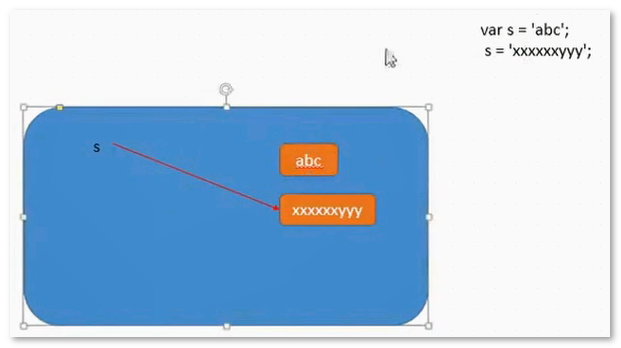

# 字符串常用方法

## 基本包装类型

为了方便操作简单数据类型，JavaScript提供了3个特殊的基本包装类型：String/Number/Boolean.

```js
// 下面的代码的问题？
// s1是基本数据类型，而基本类型没有属性和方法
var s1 = 'zhangsan'
var s2 = s1.substring(5)

// 当调用s1.substring(5)时，先把s1包装成了String类型的临时对象，再调用substring()方法，最后销毁对象，相当于：
var _s1 = new String('zhangsan')
var s2 = _s1.substring(5)
_s1 = null
```

```js
// 创建基本包装类型的对象
var num = 18				// 基本类型
var num = Number('18')		// 类型转换
var num = new Number(18)	// 基本包装类型，是一个对象
// Number和Boolean这两个基本包装类型基本不用，使用的话可能引起歧义。例如：
var b1 = new Boolean(false)
var b2 = b1 && true
// 结果为true，因为b1是一个object，而只有0/-0/false/undefined/null/''/NaN才会转换成false。
```

## String对象

### 字符串的不可变性

```js
var str = 'abc'
str = 'xxxxxxyyy'
// 当重新给str赋值的时候，常量'abc'不会被修改，依然在内存中，
// 而会重新在内存中开辟空间存放新字符串，这个特点就是“字符串的不可变性”
```



> 由于字符串的不可变性，导致在大量拼接字符串时会有效率问题。

### 字符串常用方法

**字符串所有方法都不会修改字符串本身（字符串的不可变性）**，操作完成会返回一个新字符串。

```js
// 1. 字符方法
charAt(index)  		// 获取指定位置的字符
charCodeAt(index)   // 获取指定位置的字符的ASCII码
str[index]  		// html5,IE8+,等效于charAt()

// 2. 字符串操作方法
concat()			// 拼接字符串，返回一个新的字符串（等效于+，但是+更常用）
slice(start, end)	// 截取[start, end)范围内的字符返回新的字符串
substring(start, end) // 效果类似slice()
substr(start, length) // 从start处截取length个字符串返回新的字符串

// 3. 位置方法
indexOf()
lastIndexOf()

// 4. 去除前后空白
trim()

// 5. 大小写转换
toUpperCase()
toLowerCase()

// 6. 其它
search()  			// 效果类似indexOf,但是功能更强大，支持正则表达式
replace()			// 替换字符串
split()				// 分割字符串
String.fromCharCode()  // 把ASCII码转换成字符
// String.fromCharCode(97, 98, 99)  - "abc"
```

### 案例

- 去除字符串中所有的空格

```js
var s = '    abc      xyz a      123   '
var arr = s.split(' ')
var newStr = arr.join('')
console.log(newStr)
```

- 截取字符串“我爱中华人民共和国”中的“中华”

```js
var s = '我爱中华人民共和国'
s = s.substr(2, 2)
console.log(s)
```

- 查找字符串"abcoefoxyozzopp"中所有o出现的位置

```js
function findPos(str, ch){
    var index = -1
    do {
        index = str.indexOf(ch, index + 1)
        if(index !== -1){
            console.log(index)
        }
    } while (index !== -1)
}

var str = 'abcoefoxyozzopp'
findPos(str, 'o')  // 3  6  9  12
```

- 把字符串"abcoefoxyozzopp"中所有的o替换成!

```js
// 方法1
function replace(str, oldCh, newCh){
    while(str.indexOf(oldCh) !== -1){
        str = str.replace(oldCh, newCh)
    }
    return str
}

var str = 'abcoefoxyozzopp'
str = replace(str, 'o', '!')
console.log(str)


// 方法2
var s = str.replace(/o/g, '!')
console.log(s)
```

- 找出一个字符串中出现最多的字符，并统计出现的次数

```js
function findMaxCountChar(str){
    var ch, count = 0
    var obj = {}
    for(var i = 0; i < str.length; i++){
        if(obj[str[i]]){
            obj[str[i]] ++
        }else{
            obj[str[i]] = 1
        }
    }
    for(var key in obj){
        if(obj[key] > count){
            count = obj[key]
            ch = key
        }
    }
    console.log(ch, count)
}

var str = 'abcoefoxyozzopp'
findMaxCountChar(str)  // o 4
```

