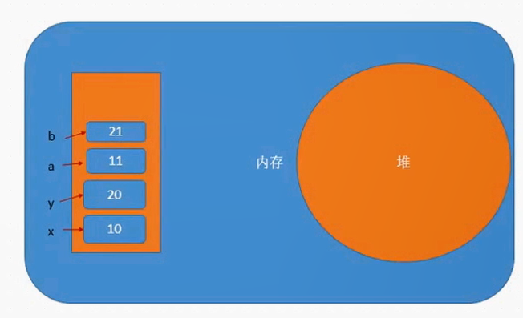
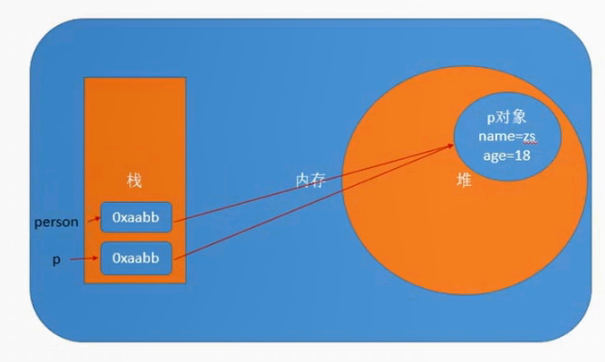

# 对象

js中的对象就是生活中的对象的抽象。

js中对象是**无序属性**的集合，对象具有**属性**和**方法**。

## 创建对象的方式

### 字面量方式

```js
var person = {
    name: 'yuusha',
    age: 23,
    sayName: function(){
        console.log(this.name)
    }
}
```

### 构造函数方式

```js
var person = new Object()
person.name = 'yuusha'
person.age = 23
person.sayName = function(){
    console.log(this.name)
}
```

### 自定义构造函数方式 (重要)

构造函数和普通函数的区别： **构造函数名称的所有首字母都大写**。

```js
function Person(name, age){
    this.name = name
    this.age = age
    this.sayName = function(){
        console.log(this.name)
    }
}

var person = new Person('yuusha', 23)
```

**new关键字的执行过程**

- 创建一个空的对象
- 将构造函数中的this指向该空对象
- 执行构造函数中的代码
- 返回该对象

## 遍历对象

使用 `for...in` 语句来遍历对象

```js
var obj = {
    name: 'yuusha',
    age: 23,
    sayName: function(){
        console.log(this.name)
    }
}
for(var key in obj){
    console.log(key + '-----------' + obj[key])
}
//name-----------yuusha
//age-----------23
//sayName-----------function(){
//  console.log(this.name)
//}
```

## 删除对象的属性

使用 `delete` 关键字删除对象的属性

```js
var obj = {
    name: 'yuusha',
    age: 23
}
delete obj.name
console.log(obj)  // {age: 23}
```

## 数据在内存中的存储

- 简单数据类型（值类型） - 变量中存储的是**值本身**
  - Number、String、Boolean、Undefined、Null
- 复杂数据类型（引用类型） - 变量中存储的是**引用地址**
  - Object

**简单数据类型存放在内存中的栈上**


**复杂数据类型存放在内存中的堆上**


> 只有使用 `new` 关键字才会在堆上新建一个对象。

简单数据类型作为函数的参数：

```js
function fn(a, b){
    a += 1
    b += 1
}
var x = 10 
var y = 20
fn(x, y)
console.log(x)  // 10
console.log(y)  // 20
```



复杂数据类型作为函数的参数：

```js
function Person(name, age){
    this.name = name
    this.age = age
}
function fn(person){
    person.name = 'ls'
}
var p = new Person('zs', 18)
fn(p)
console.log(p.name)  // "ls"
```



### 练习

```js
function Person(name, age){
    this.name = name
    this.age = age
}
function f1(person){
    person.name = 'ls'
    person = new Person('aa', 18)
    console.log(person.name)
}
var p = new Person('zs',18)
f1(p)
console.log(p.name)

/* 答案： aa   ls */
```

