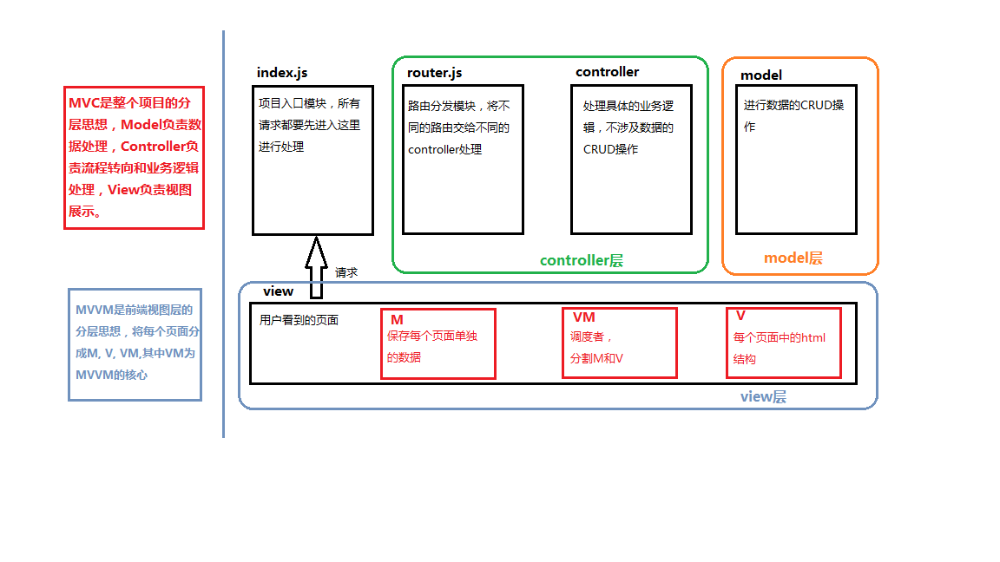

# vue基础

- [框架和库的区别](#框架和库的区别)
- [MVC和MVVM的区别](#mvc和mvvm的区别)
- [vue基本代码结构](#vue基本代码结构)
- [走马灯练习](#走马灯练习)
- [事件修饰符](#事件修饰符)
- [v-model指令](#v-model指令)
- [vue中绑定class属性 v-bind:class](#vue中绑定class属性-v-bindclass)
- [vue中绑定style属性 v-bind:style](#vue中绑定style属性-v-bindstyle)
- [v-for指令](#v-for指令)
- [v-if指令和v-show指令](#v-if指令和v-show指令)

## 框架和库的区别
- 框架： 一套完整的解决方案，对项目侵入性较大，如果需要更换框架需要重构项目
- 库（插件）：提供某个小功能，对项目侵入性小，如果某个库不满足需求很容易就可以切换到其他库（如从ejs切换到art-template）

## MVC和MVVM的区别


## vue基本代码结构
```html
<div id="app">
    <p>{{msg}}</p>
</div>

<script src="./node_modules/vue/dist/vue.js"></script>
<script>
    var vm = new Vue({
        el: '#app',
        data: {
            msg: 'hello Vue.js'
        }
    })
</script>
```

- `{\{}}`：插值表达式
- `v-text`指令：功能类似插值表达式，但是网速慢时没有闪烁问题

    ```html
    <p v-text="msg">placeholder</p>
    ```
> `v-cloak`指令可以解决网速慢时插值表达式闪烁问题

```html
<style>
    [v-cloak] {
        display: none;
    }
</style>

<div id="app">
    <p>{{msg}}</p>
</div>
```
- `v-html`指令：文本以html方式解析，不转义特殊字符
    
    ```html
    <p v-text="msg_html">v-html</p>
    <p v-html="msg_html">v-html</p>
    ```
- `v-bind`指令：将元素的属性和数据绑定

    ```html
    <button v-bind:title="msg">click</button>
    ```
  > 简写方式：`:`

  ```html
  <button :title="msg">click</button>
  ```
- `v-on`指令： 绑定事件

    ```html
    <button v-on:click="show">v-on:click</button>

    var vm = new Vue({
        el: '#app',
        data: {},
        methods: {
            show: function (){
                alert('hello Vue.js')
            }
        }
    })
    ```
  > 简写方式：`@`

  ```html
   <button @click="show">v-on:click</button>
  ```


## 走马灯练习
在Vue实例中获取data中的变量或者methods中的方法要加上`this.`。

```html
<body>

    <div id="app">
        <p v-text="text"></p>
        <button @click="run">run</button>
        <button @click="stop">stop</button>
    </div>
    
    <script src="./node_modules/vue/dist/vue.js"></script>
    <script>
        var vm = new Vue({
            el: '#app',
            data: {
                text: '猥琐发育，别浪~~！',
                timer: null
            },
            methods: {
                run(){
                    if(this.timer){
                        clearInterval(this.timer)
                        this.timer = null
                    }
                    this.timer = setInterval(() => {
                        this.text = this.text.substring(1) + this.text.substring(0, 1)
                    }, 400)
                },
                stop(){
                    clearInterval(this.timer)
                    this.timer = null
                }
            }
        })
    </script>
</body>
```

## 事件修饰符
- .stop: 阻止冒泡
- .prevent: 禁止默认行为
- .capture: 捕获阶段触发
- .self: 事件触发源为该元素本身时才触发
- .once: 事件只触发一次

以`.stop`修饰符为例：
```html
<body>
    <div id="app">
        <div class="parent" @click="parentClickHandler">
            parent
            <div class="son" @click.stop="sonClickHandler">son</div>
        </div>
    </div>

    <script src="./node_modules/vue/dist/vue.js"></script>
    <script>
        var vm = new Vue({
            el: '#app',
            data: {
            },
            methods: {
                parentClickHandler(){
                    console.log('clicked parent')
                },
                sonClickHandler(){
                    console.log('clicked son')
                }
            }
        })
    </script>
</body>
```

## v-model指令
`v-bind`指令只能实现 `M -> V` 的绑定，而 `v-model` 指令可以实现数据的**双向绑定**。
> 注意： `v-model` 只能用于表单元素。  

例子：
```html
<body>
    <div id="app">
        <input type="text" v-model="msg">
        <p>entered: {{msg}}</p>
    </div>

    <script src="node_modules/vue/dist/vue.js"></script>
    <script>
        var vm = new Vue({
            el: '#app',
            data: {
                msg: 'this is default msg'
            },
        })
    </script>
</body>
```

## vue中绑定class属性 v-bind:class
- 第一种方式： 类名数组
  - `<p :class="['btn','btn-link']"></p>`
- 第二种方式： 类对象
  - `<p :class="{btn: true, btn-link: true}"></p>`

示例
```html
<style>
    .bg-green {
        background-color: lightgreen;
    }
    .color-red {
        color: red;
    }
</style>
<body>
    <div id="app">
        <p :class="classArr">classArr</p>
        <p :class="classObj">classArr</p>
    </div>

    <script src="node_modules/vue/dist/vue.js"></script>
    <script>
        var vm = new Vue({
            el: '#app',
            data: {
                classArr: ['bg-green', 'color-red'],
                classObj: {'bg-green': true, 'color-red': true}
            }
        })
    </script>
</body>
```

## vue中绑定style属性 v-bind:style
- 第一种方式： 对象形式
  - `:style="{fontSize: 18}"`
- 第二种方式： 多个对象数组
  - `:style="[{fontSize: 18, fontWeight: 400}, {color: 'red'}]"`

示例：
```html
<body>
    <div id="app">
        <p :style="styleObj1">first line</p>
        <p :style="[styleObj1, styleObj2]">second line</p>
    </div>

    <script src="./node_modules/vue/dist/vue.js"></script>
    <script>
        var vm = new Vue({
            el: '#app',
            data: {
                styleObj1: { fontSize: 18, fontWeight: 800},
                styleObj2: {color: 'red'}
            }
        })
    </script>
</body>
```

## v-for指令
`v-for` 指令可以遍历 数组、对象。
- 遍历数组
  - `<p v-for="(item, i) in list">{{i}} --- {{item}}</p>`
- 遍历对象
  - `<p v-for="(val, key, i) in user">{{i}} --- {{key}} --- {{val}}</p>`

> `v-for`指令注意事项：
> 必须绑定一个 `:key` 属性，用于区别各个项，所以该属性的值也必须能够唯一标识该项。

示例：
```html
<body>
    <div id="app">
        <p v-for="(item, i) in list" :key="item"><input type="checkbox"> {{i}} --- {{item}}</p>
        <p v-for="(val, key, i) in user" :key="key">
            {{i}} --- {{key}} --- {{val}}
        </p>
    </div>

    <script src="./node_modules/vue/dist/vue.js"></script>
    <script>
        var vm = new Vue({
            el: '#app',
            data: {
                list: ['apple', 'banana', 'pear'],
                user: {
                    name: '_yuusha',
                    age: 12,
                    gender: 'male'
                }
            }
        })
    </script>
</body>
```

## v-if指令和v-show指令
`v-if`指令控制元素是否渲染（是否创建该dom元素）
`v-show`指令控制元素是否显示（display是否为none）

示例：
```html
<body>
    <div id="app">
        <p v-if="flag">this is v-if tag</p>
        <p v-show="flag">this is v-show tag</p>
        <button @click="toggle">toggle</button>
    </div>

    <script src="./node_modules/vue/dist/vue.js"></script>
    <script>
        var vm = new Vue({
            el: '#app',
            data: {
                flag: true
            },
            methods: {
                toggle(){
                    this.flag = !this.flag
                }
            }
        })
    </script>
</body>
```


