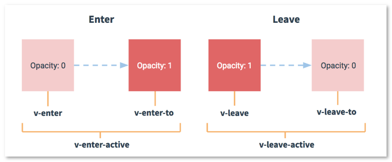

# vue过渡和动画

- [单元素/组件过渡 - transition组件](#单元素组件过渡---transition组件)
  - [过渡类名](#过渡类名)
  - [CSS过渡](#css过渡)
  - [CSS动画](#css动画)
  - [自定义过渡类名](#自定义过渡类名)
  - [过渡组件的JavaScript钩子函数](#过渡组件的javascript钩子函数)
  - [初始渲染时的过渡](#初始渲染时的过渡)
  - [多元素过渡](#多元素过渡)
    - [过渡模式](#过渡模式)
  - [列表过渡](#列表过渡)
    - [列表项进入/离开过渡](#列表项进入离开过渡)
    - [列表的排序过渡](#列表的排序过渡)

## 单元素/组件过渡 - transition组件
使用Vue提供的 `transition` 组件，可以给任何元素或组件添加进入/离开过渡效果。  
当插入或删除包含在 `transition` 组件中的元素时，Vue会进行以下处理：  
1. 自动判断目标是否使用CSS过渡或者动画，如果是，会在恰当的时机添加类名或删除CSS类名；
2. 如果过渡组件上定义了JavaScript钩子函数，这些钩子函数将在恰当的时机被调用；
3. 上面两者都没有，则DOM的添加/删除操作将在下一帧中立即执行。

### 过渡类名
进入/离开过渡过程中，会有6个类的切换。  
  
如果使用没有定义 `name` 的 `<transition>` ,那么 `v-` 将会是这些类名的默认前缀；  
如果使用了 `<transition name="slide-fade">`, 那么 `v-enter` 会被替换成 `slide-fade-enter` 。  

### CSS过渡
```html
<style>
.slide-fade-enter,
.slide-fade-leave-to {
  opacity: 0;
  transform: translateX(200px);
}

.slide-fade-enter-active,
.slide-fade-leave-active {
  transition: all 1s;
}
</style>

<div id="#app">
  <button @click="flag = !flag"></button>
  <transition name="slide-fade">
    <h3 v-if="flag">this is a H3 tag</h3>
  </transition>
</div>

<script>
new Vue({
  el: '#app',
  data: {
    flag: true
  }
})
</script>
```
> CSS过渡完成的事件监听器是 `transitionend` 。

### CSS动画
CSS动画用法同CSS过渡，区别是在动画中 `v-enter` 类名在节点插入DOM后不会立即删除，而是在 `animationend` 事件触发时删除。  
```html
<style>
  .animate-enter-active {
    animation: bounce-in .7s;
  }

  .animate-leave-active {
    animation: bounce-in .7s reverse;
  }

  @keyframes bounce-in {
    0% {
      transform: scale(0);
    }
    60% {
      transform: scale(1.4);
    }
    100% {
      transform: scale(1);
    }
  }
</style>

<div id="app">
  <button @click="flag = !flag">toggle</button>
  <transition name="animate">
    <h3 v-if="flag">this is H3 tag</h3>
  </transition>
</div>

<script>
  var vm = new Vue({
    el: '#app',
    data: {
      flag: true
    },
    methods: {
    },
  })
</script>
```

### 自定义过渡类名
可以通过在transition组件上添加以下属性来自定义过渡类名，这对于**Vue的过渡系统和第三方的CSS动画库结合使用**十分有用。  
- enter-class
- enter-active-class
- enter-to-class
- leave-class
- leave-active-class
- leave-to-class

示例(与Animate.css结合使用)：
```html
<link href="https://cdn.jsdelivr.net/npm/animate.css@3.5.1" rel="stylesheet" type="text/css">  
<transition name="custom-classes-transition"
  enter-active-class="animated tada"
  leave-active-class="animated bounceOutRight">
  <h3 v-if="flag">this is H3 tag</h3>
</transition>
```

### 过渡组件的JavaScript钩子函数
可以在过渡组件 `<transition>` 上声明JavaScript钩子
```html
<transition 
  @before-enter="handleBeforeEnter"
  @enter="handleEnter"
  @after-enter="handleAfterEnter"
  @enter-cancelled="enterCancelled"

  @before-leave="handleBeforeLeave"
  @leave="handleLeave"
  @after-leave="handleAfterLeave"
  @leave-cancelled="leaveCancelled">
  <p>this is p tag</p>
</transition>

<script>
new Vue({
  ...
  methods: {
    handleBeforeEnter(el){
      el.style.opacity = 1
    },
    handleEnter(el, done){
      // ...
      done()
    }
    ...
  }
})
</script>
```
> 只使用JavaScript过渡时，`enter` 和 `leave` 中必须要使用第二个参数 `done` ，否则它们将被同步调用，过渡会立刻完成 

### 初始渲染时的过渡
通过 `appear` 属性可以设置初始渲染时的过渡效果，同样可以自定义类名和定义钩子函数。   
1. 自定义CSS类名  
    ```html
    <transition
      appear
      appear-class="custom-appear-class"
      appear-to-class="custom-appear-to-class"
      appear-active-class="custom-appear-active-class">
    ...
    </transition>
    ```

2. 自定义JavaScript钩子函数  
  ```html
  <transition 
    appear
    @before-appear="beforeAppear"
    @appear="appear"
    @afterAppear="afterAppear"
    @appear-cancelled="appearCancelled">
    ...
  </transition>
  ```

### 多元素过渡
两个元素的过渡，可以使用 `v-if/v-else` 标签：  
```html
<transition name="slide">
  <button v-if="isEditing" @click="isEditing = !isEditing" key="save">Save</button>
  <button v-else="isEditing" @click="isEditing = !isEditing" key="edit">Edit</button>
</transition>
```
> 但是需要注意的是，相同标签名的元素切换时，必须指定 `key` ，否则没有过渡效果。

#### 过渡模式
`<transition>` 组件可以定义 `mode` 属性指定多元素过渡时的过度模式：
- `in-out` : 新元素先进行过渡，完成后当前元素过渡离开
- `out-in` : 当前元素先进行过渡，完成后新元素过渡进入

### 列表过渡
对于 `v-for` 渲染的列表，添加过渡效果使用 `<transition-group>` 组件。  
`<transition-group>` 组件的注意点： 
1. 不同于 `<transition>` , `<transition-group>` 组件会渲染成一个真实的元素，默认为 `<span>`， 如果需要更改，可以使用 `tag` 属性指定；
2. `<transition-group>` 组件中没有 **过渡模式**， 因为没有相互切换的元素；
3. `<transition-group>` 中的元素**总是需要**提供唯一的 `key` 属性值。

#### 列表项进入/离开过渡
```html
<transition-group name="slide-up" tag="ul">
  <li v-for="item in list" :key="item">
    {{item}}
  </li>
</transition-group>
```
> 存在问题： 新增/删除列表项时，周围元素不是平滑过渡到新的位置。

#### 列表的排序过渡
`<transition-group>` 的 `v-move` 特性可以实现列表元素平滑过渡到新位置。  
使用方法：
1. 可以使用CSS类名 `transition-group-name-move` (默认为 `v-move` )来设置列表元素移动到新位置过程中的CSS样式；
2. 还可以通过 `move-class` 自定义过渡类名。
```html
<style>
.slide-up-move {
  transition: transform 2s;
}
</style>
<transition-group name="slide-up" tag="ul"> 
  <li v-for="item in list" :key="item">
    {{item}}
  </li>
</transition-group>
```
> 如果需要删除列表项时，同样有过渡效果，需要设置
> ```css
> .slide-up-leave-active {
>   position: absolute;
> }
> ```
> 添加/删除的那一项置于最顶层，需要设置
> ```css
> .slide-up-enter-active {
>    position: relative;
>    z-index: 1;
>  }
>  .slide-up-leave-active {
>    position: absolute;
>    z-index: 1;
>  }
> ```