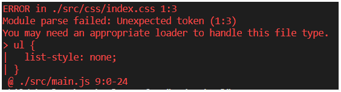

# webpack之loader使用

- [使用webpack打包css文件](#使用webpack打包css文件)
  - [webpack处理less文件](#webpack处理less文件)
  - [webpack处理sass/scss文件](#webpack处理sassscss文件)
- [webpack处理URL路径](#webpack处理url路径)
  - [添加字体文件的匹配规则](#添加字体文件的匹配规则)
- [webpack中配置babel7](#webpack中配置babel7)
- [总结webpack处理非js文件的过程](#总结webpack处理非js文件的过程)

## 使用webpack打包css文件
直接在 `main.js` 文件中引入 `css` 文件  
```js
import './css/index.css'
```  
然后运行webpack命令会报错，提示可能需要一个适当的loader来处理该类型文件：  
  
因为 `webpack` 默认只能打包js文件，无法处理其它类型文件，如果想要处理其它类型的文件，需要手动安装相应的加载器loader。  
处理css文件需要的加载器： `style-loader` 和 `css-loader`。
1. 安装 `style-loader` 和 `css-loader`：  
   ```sh
   npm i style-loader css-loader -D
   ```
2. 修改 `webpack.config.js` 配置文件：  
   ```js
   module.exports = {
     // ...
     // module属性用于配置所有的 第三方模块加载器
     module: {  
       // rules属性定义匹配规则
       rules: [  
         // 配置处理 .css 结尾的文件的loader 规则
         { test: /\.css$/, use: ['style-loader', 'css-loader']},  
       ]
     }
     // ...
   }
   ```
### webpack处理less文件
1. 安装loader:
   ```sh
   # less-loader 依赖于less，如果不安装less会提示缺少peerDepedencies
   npm i less-loader less -D
   ```
2. 配置匹配规则：  
   ```js
   module: {
     rules: [
       // less文件的loader匹配规则
       { test: /\.less$/, use: ['style-loader', 'css-loader', 'less-loader']}
     ]
   }
   ```
> less是css预处理器，`less-loader`只是将less语法转为css语法，所以还是需要 `css-loader` 和 `style-loader` 的，从这里也可以看出**loader调用顺序是从后往前的**。

### webpack处理sass/scss文件
1. 安装loader:
   ```sh
   # sass-loader 依赖于 node-sass
   npm i sass-loader node-sass -D
   ```
2. 配置匹配规则：
   ```js
   module: {
     rules: [
       // sass/scss文件的loader匹配规则
       { test: /\.(sass|scss)$/, use: ['style-loader', 'css-loader', 'sass-loader']}
     ]
   }
   ```

## webpack处理URL路径
1. 安装loader:
   ```sh
   # url-loader 依赖于 file-loader
   npm i url-loader file-loader -D
   ```
2. 配置匹配规则：
   ```js
   module: {
     rules: [
       // 处理url路径的loader匹配规则
       { test: /\.(jpg|jpeg|gif|bmp|png|svg)$/, use: 'url-loader'}
     ]
   }
   ```
`url-loader` 默认情况下，会将所有图片都进行base64转码，可以通过 `limit` 来设置不进行base64转码：  
```js
'url-loader?limit=20480' 
// 表示大于等于20480字节的图片不进行base64转码。 
``` 
另外，`url-loader` 默认会将不进行base64转码的图片路径中名称变成hash值，如果不想变成hash值，可以通过 `name` 来设置：  
```js
'url-loader?limit=20480&name=[hash:8]-[name].[ext]' 
// 表示url名称为8位hash值加上原来的name和ext【hash是必要的，防止重名】
```
### 添加字体文件的匹配规则
字体文件只需使用 `file-loader` 处理。 
> `file-loader` 作用是将文件发送到输出文件夹，并且返回（相对）URL;  
> `url-loader` 作用同 `file-loader`，但是文件小于限制时可以返回 dataURL。  
配置规则如下：  
```js
module: {
  rules: [
    // 处理字体文件的loader匹配规则
    { test: /\.(ttf|svg|eot|woff|woff2)$/, use: 'file-loader'}
  ]
}
```

## webpack中配置babel7
> 注意：babel版本为7.x。  
1. 安装loader：
   ```sh
   yarn add babel-loader @babel/core @babel/preset-env -D
   # 注意 @babel/polyfill是项目依赖
   yarn add @babel/polyfill
   ```
2. 修改 `webpack.config.js` 配置文件：  
   ```js
   module: {
     rules: [
       // 配置babelloader的匹配规则，
       // **注意：必须添加 exclude属性，让babel忽略 node_modules 目录**
       { test: /\.js$/, use: 'babel-loader', exclude: /node_modules/}
     ]
   }
   ```
3. 根目录中添加 `babel.config.js` 配置文件：  
   ```js
   const presets = [
     [
       '@babel/env',
       {
         useBuiltIns: 'usage',
       },
     ],
   ],
   const plugins = []
   module.exports = { 
     presets,
     plugins,
   }
   ```

## 总结webpack处理非js文件的过程
1. 查找配置文件中对应的处理规则，
2. 找到对应的额规则后，调用相应的loader进行处理，
3. 调用loader时，**从后往前调用loader**【所以调用顺序很重要，不能颠倒】，
4. 所有loader处理完成后，交给webpack打包合并到bundle.js文件中。