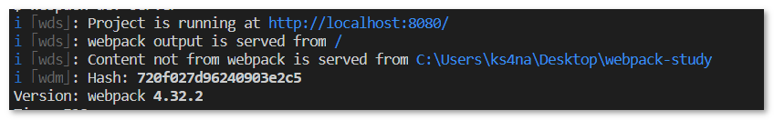
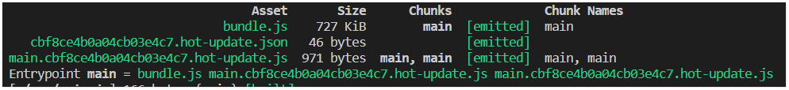
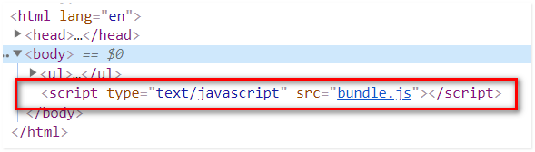

# webpack之plugin使用

- [实现webpack实时打包构建](#实现webpack实时打包构建)
- [webpack-dev-server常用命令](#webpack-dev-server常用命令)
  - [指定启动时的根目录](#指定启动时的根目录)
  - [自动打开浏览器](#自动打开浏览器)
  - [自定义端口号](#自定义端口号)
  - [模块热替换](#模块热替换)
- [使用html-webpack-plugin插件](#使用html-webpack-plugin插件)

## 实现webpack实时打包构建
每次修改代码之后都需要运行`webpack` 命令打包，比较麻烦，可以使用 `webpack-dev-server` 来实现代码的实时打包编译，当修改代码后，会自动进行打包构建。  
步骤：
1. 开发依赖中添加 `webpack` 和 `webpack-dev-server`：  
   ```sh
   # webpack-dev-server 需要在开发依赖中安装 webpack
   yarn add webpack-dev-server webpack -D
   ```
2. 运行 `webpack-dev-server` 命令
   由于  `webpack-dev-server` 安装在开发依赖中，而不是全局安装，所以无法直接输入 `webpack-dev-server` 命令运行，可以在 `package.json` 的 `scripts` 中添加 `dev` 命令脚本：  
   > ```js
   >   "dev": "webpack-dev-server"
   > ```
   运行 `npm run dev` 命令后，提示信息如图：  
     
   构建成功了，但是浏览器打开 `http://localhost:8080/src/index.html` 却不会变化。  
   原因是**由于需要实时编译**，所以 `webpack-dev-server` 将打包的 `bundle.js` 放在了**内存中**的项目根目录。  
   调整 `index.html` 中的 `script` 标签 `src` 属性为根目录的 `/bundle.js` ，即可看到效果。

## webpack-dev-server常用命令
### 指定启动时的根目录
webpack-dev-server启动后打开的根目录是项目根目录，需要手动点击`src`才能进入`src` 下面的 `index.html` 页面中。  
在 `dev` 命令中添加 `--contentBase` 参数可以指定启动时的根目录：  
```js
"dev": "webpack-dev-server --contentBase ./src"
```

### 自动打开浏览器
在 `dev` 命令中添加 `--open` 参数：  
```js
"dev": "webpack-dev-server --open"
```
### 自定义端口号
在 `dev` 命令中添加 `--port` 参数：  
```js
"dev": "webpack-dev-server --port 5050"
```
### 模块热替换
> 模块热替换应当用于开发环境，不适用于生产环境。
在 `dev` 命令中添加 `--hot` 参数：  
```js
"dev": "webpack-dev-server --hot"
```
之后再修改代码，webpack不是重新打包生成 `bundle.js` 文件，而是生成补丁文件，如下图：  
  

> 以上四个命令在 `webpack.config.js` 中配置方式如下：
> ```js
> module.exports = {
>   // ...
>   // 添加 devServer 属性
>   devServer: {
>     contentBase: './src',   // 指定启动时的根目录
>     open: true,             // 自动打开浏览器
>     port: 5050,             // 自定义端口号
>     hot: true               // 模块热更新
>   }
>   // ...
> }
> ```
> 还需要开启模块热更替插件【`--hot` 命令不需要此设置，自动开启】：
> ```js
> const webpack = require('webpack')
> module.exports = {
>   // ...
>   // 添加 plugins 属性
>   plugins: [
>     new webpack.HotModuleReplacementPlugin()
>   ]
>   // ...
> }
> ```
> 相比较来说，使用命令行参数的方式比使用配置文件的方式更方便一点。

## 使用html-webpack-plugin插件
使用 `--contentBase` 方式指定项目根目录的方式比较繁琐，需要指定启动目录，还需要修改 `index.html` 中 `script` 标签的 `src` 属性。  
所以推荐使用 `html-webpack-plugin` 插件配置启动页面。  
该插件可以在内存中生成一份指定文件的副本并且自动引用内存中的 `bundle.js` ，所以无需在 `index.html` 页面中手动引用 `dist/bundle.js`；  
并且在使用 `webpack` 命令打包时会将内存中的副本也同时打包到指定的目录（如dist目录）。  
步骤：
1. 安装
   开发依赖中添加 `html-webpack-plugin`：  
   ```sh
   npm i html-webpack-plugin -D
   ```  
2. 修改 `webpack.config.js` ：  
   ```js
   const htmlWebpackPlugin = require('html-webpack-plugin')

   module.exports = {
     // ...
     // 在plugins属性中添加htmlWebpackPlugin插件
     plugins: [
       new htmlWebpackPlugin({
         template: path.join(__dirname, 'src/index.html'),  // 要生成到内存中的模板文件
         filename: 'index.html'  // 生成到内存中的文件的名称
       })
     ]
     // ...
   }
   ```
3. 运行命令
   修改 `dev`命令,去掉 `--contentBase` 然后运行 `dev` 命令。  
   打开的页面中自动添加了对 `bundle.js` 的引用。  
   