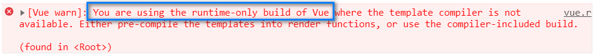
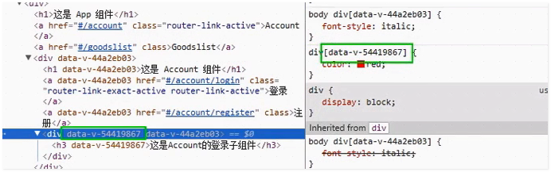

# webpack之结合vue使用

- [webpack中import的vue包和网页中引入的vue包的区别](#webpack中import的vue包和网页中引入的vue包的区别)
  - [暂时的解决方案](#暂时的解决方案)
- [vue实例的render方法](#vue实例的render方法)
- [webpack结合vue使用](#webpack结合vue使用)
- [webpack中的vue添加vue-router](#webpack中的vue添加vue-router)
  - [抽离路由模块](#抽离路由模块)
- [vue组件文件介绍](#vue组件文件介绍)

## webpack中import的vue包和网页中引入的vue包的区别
尝试直接在 `main.js` 中引入 vue：  
```js
import Vue from 'vue'

const vm = new Vue({
  el: '#app',
  data: {
    msg: 'hello, Vue.js',
  },
})
```  
提示正在使用`runtime vue`的错误：  
  
原因是vue的package.json中入口函数指向的是 `runtime` 版本：    
```json
"main": "dist/vue.runtime.common.js"
```

> 总结： webpack中引入的vue包只包含运行时环境，而网页中引入vue包是最全的vue包。  

### 暂时的解决方案
- 方案一-手动引入最全的vue包
  ```js
  import Vue from 'vue/dist/vue.js'
  ```
- 方案二-webpack中将`vue`设置为别名，手动指向`vue.js`
   ```js
   // webpack.config.js

   module.exports = {
     // ...
     resolve: {
       alias: {
         'vue$': 'vue/dist/vue.js',
       }
     }
   }
   ```

## vue实例的render方法
vue实例有一个render属性，可以将指定的组件**替换**到vue实例控制的区域（#app）：  
```js

// 定义一个组件
var customComp = {
  template: '<h2>customComp</h2>',
}

var vm = new Vue({
  el: '#app',
  data: { },
  // render方法，参数createElements为一个函数，render方法的返回值将替换掉#app
  render: (createElements) => {
    return createElements(customComp)
  },
})
```

## webpack结合vue使用
前面提到vue默认引入的是 `runtime` 版本，所以在 webpack 中使用 vue 有其它写法：  
步骤：  
1. 创建 `App.vue` 文件，该文件代表一个vue组件, `.vue` 文件有三个标签：`<template>` 用于写html代码，`<script>` 用于写js代码，`<style>` 用于写css代码。  
   ```html
   <template>
     <h2>App.vue</h2>
   </template>
   <script>
     export default {
       data: () => ({  // 组件中的data必须为函数
          msg: '',
        }),
     }
   </script>
   <style>
   </style>
   ```
2. 在 `main.js` 中引入 `vue` 和 `App` 组件， 并将 `App` 组件通过 `render` 函数替换掉 `#app`：   
   ```js
   import Vue from 'vue'
   import App from './App.vue'

   var vm = new Vue({
     el: '#app',
     data: { },
     render: c => c(App),  // 这里将render函数的写法简化了
   })
   ```
3. 由于引入的是`runtime`版本的vue，所以需要添加`vue-loader`来处理`.vue`文件：  
   ```sh
   # vue-loader 依赖于 vue-template-compiler
   yarn add -D vue-loader vue-template-compiler
   ```
   修改webpack配置文件，添加 `vue-loader` :  
   ```js
   // ...
   module: {
     rules: [
       // 处理 .vue 文件的loader 匹配规则
       { test: /\.vue$/, use: 'vue-loader' },
     ]
   }
   // ...
   ```  
   版本 `>= 15` 的 `vue-loader` 还需要配置 `VueLoaderPlugin` 插件：   
   ```js
   // webpack.config.js
   const VueLoaderPlugin = require('vue-loader/lib/plugin')

   module.exports = {
     // ...
     plugins: [
       new vueLoaderPlugin(),
     ]
     // ...
   }
   ```

## webpack中的vue添加vue-router
1. 首先安装 `vue-router` ：  
   ```sh
   yarn add vue-router
   ```
2. 将 `vue-router` 安装到 `vue` 上：  
   ```js
   // main.js
   import VueRouter from 'vue-router'

   Vue.use(VueRouter)
   ```  
3. 创建 `VueRouter` 实例，定义路由：  
   ```js
   // main.js

   // 引入 Login 和 Register 两个组件(自行创建)
   import Login from './Login.vue'
   import Register from './Register.vue'

   // 创建 VueRouter 实例
   var router = new VueRouter({
     routes: [
       { path: '/login', component: Login },
       { path: '/register', component: Register },
     ]
   })

   // 将 VueRouter 实例挂载到 Vue 实例上
   var vm = new Vue({
     // ...
     render: c => c(App),
     router,
   })
   ```
4. 在 `App.vue` 中添加 `<router-view>`标签，和指向 `/login`,`/register`的两个`<router-link>` 链接：  
   ```html
   <template>
    <div>
      <h2>App.vue</h2>
      <router-link to="/login">Login</router-link>
      <router-link to="/register">Register</router-link>

      <router-view></router-view>
    </div>
   </template>

   <script></script>

   <style></style>
   ```  

### 抽离路由模块
将路由模块从 `main.js` 中抽离出来，形成一个单独的模块 `router.js` ：  
```js
// router.js

import VueRouter from 'vue-router'

import Login from './Login.vue'
import Register from './Register.vue'

// 创建 VueRouter实例
const router = new VueRouter({
  routes: [
    { path: '/login', component: Login },
    { path: '/register', component: Register },
  ]
})

export default router
```  
`main.js` 中 `VueRouter` 实例创建相关的代码剪切到 `router.js` 中，然后引入 `router.js` ：  
```js
// main.js

import router from './router.js'
// ...
```


## vue组件文件介绍
webpack中使用 `.vue` 文件来定义vue组件：  
```html
<template>
</template>
<script>
</script>
<style>
</style>
```
`.vue` 文件中有三个标签： 
- `<template>` 标签书写html代码，
- `<script>` 标签写js代码，基本格式如下：  
  ```js
  export default {  // 使用 export default 导出
    data: () => ({  // 组件的data必须为函数
      msg: '',
    })
  }
  ```
- `<style>` 标签书写css代码，其中有两个属性：  
  - lang: 可以设置为 `less`,`scss` 等，但是需要配置相应的loader；
  - scoped: 设置该属性后，样式代码会应用于该组件及其内部的组件，而不会应用到全局【推荐添加】
    - scoped实现原理： 给组件加上自定义属性，通过属性选择器来区别  
        

> 注意： VS CODE最好安装上 `vetur` 代码提示工具，安装 `vetur` 之后，还需要修改 `settings.json` 文件，添加 `.vue` 文件的关联：  
> ```json
> "files.associations": {
>     "*.vue": "vue"
>   }
> ```