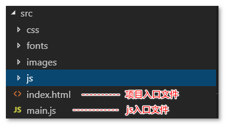

# webpack介绍和配置

- [什么是webpack](#什么是webpack)
- [安装webpack的方式](#安装webpack的方式)
- [初步使用webpack](#初步使用webpack)
- [使用webpack配置文件简化命令](#使用webpack配置文件简化命令)
  - [webpack4配置文件mode属性](#webpack4配置文件mode属性)

## 什么是webpack
webpack是一个前端项目自动化构建工具，基于nodejs开发(需要安装nodejs环境)。借助webpack可以完美实现资源的合并、打包、压缩、混淆等诸多功能。

> 本文档使用webpack的版本为 `4.x` 。

## 安装webpack的方式
- 全局安装
  - `npm install webpack webpack-cli -g`，这样可以全局使用webpack命令
- 项目依赖
  - `npm install webpack webpack-cli --save-dev`

## 初步使用webpack
1. `npm init -y` 初始化项目
2. 创建基本目录结构  
   
3. 书写隔行变色代码
    - `index.html` 中代码：
      ```html
      <body>
        <ul>
          <li>这是第1个li</li>
          <li>这是第2个li</li>
          <li>这是第3个li</li>
          <li>这是第4个li</li>
        </ul>
      </body>
      ```
    - `main.js` 中代码：
       ```js
       import $ from 'jquery'

       $(function (){
         $('li:odd').css('backgroundColor', 'red')
         $('li:even').css('backgroundColor', 'lightgreen')
       })
       ```
4. 直接在 `index.html` 中引入 `main.js` 会报错，因为浏览器无法解析 `import` 语法，所以需要通过 webpack 处理，  
   运行webpack命令：`webpack ./src/main.js --output ./dist/bundle.js` 将 `main.js` 文件打包成 `bundle.js` 放在 `dist` 目录下
5. `index.html` 中引用 `bundle.js` 即可看到隔行变色效果。

## 使用webpack配置文件简化命令
在根目录新建 `webpack.config.js` 文件：
```js
const path = require('path')

module.exports = {
  entry: path.join(__dirname, './src/main.js'),  // 入口文件
  output: {                                      // 打包后的文件
    path: path.join(__dirname, './dist'),
    filename: 'bundle.js'
  }
}
```
然后只需要在命令行输入 `webpack` 即可实现打包操作。

### webpack4配置文件mode属性
webpack4配置文件中如果不设置mode属性，打包时会提示：  
  
webpack将会默认使用 `production` 模式【生产环境】，其它可选值为： `development` , `none` 。  
不同的mode，webpack会有不同的表现（例如：，`production` 模式下会将打包的文件压缩处理）。  
可以通过设置环境变量的方式来自动修改webpack配置文件中的mode的值：
```sh
# build 命令传入NODE_ENV为production
"build": "webpack --env.NODE_ENV=production",
# start 命令传入NODE_ENV=development
"start": "webpack --env.NODE_ENV=development"
```
然后修改 `webpack.config.js`，让 `mode` 根据 `NODE_ENV` 来改变：  
```js
// 需要将 module.exports 改成函数
module.exports = function (env) {
  return {
    mode: env && env.NODE_ENV === 'production' ? env.NODE_ENV : 'development',  // mode设置成env的NODE_ENV的值
    // ...
  }
}

// =====================================
// 另一种写法：
// 在外部获取 process.env.NODE_ENV，module.exports 直接返回对象，这样看起来更加清晰
const isDevMode = process.env.NODE_ENV !== 'production' && process.env.NODE_ENV !== 'prod'

module.exports = {
  mode: isDevMode ? process.env.NODE_ENV : 'production'

  // ...
}
```