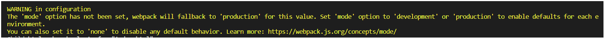

# webpack 介绍和配置

- [什么是 webpack](#%e4%bb%80%e4%b9%88%e6%98%af-webpack)
- [安装 webpack 的方式](#%e5%ae%89%e8%a3%85-webpack-%e7%9a%84%e6%96%b9%e5%bc%8f)
- [初步使用 webpack](#%e5%88%9d%e6%ad%a5%e4%bd%bf%e7%94%a8-webpack)
- [使用 webpack 配置文件简化命令](#%e4%bd%bf%e7%94%a8-webpack-%e9%85%8d%e7%bd%ae%e6%96%87%e4%bb%b6%e7%ae%80%e5%8c%96%e5%91%bd%e4%bb%a4)
  - [webpack4 配置文件 mode 属性](#webpack4-%e9%85%8d%e7%bd%ae%e6%96%87%e4%bb%b6-mode-%e5%b1%9e%e6%80%a7)
- [webpack 配置进阶](#webpack-%e9%85%8d%e7%bd%ae%e8%bf%9b%e9%98%b6)
  - [webpack 配置 sourcemap](#webpack-%e9%85%8d%e7%bd%ae-sourcemap)
  - [webpack 配置 output.publicPath](#webpack-%e9%85%8d%e7%bd%ae-outputpublicpath)

## 什么是 webpack

webpack 是一个前端项目自动化构建工具，基于 nodejs 开发(需要安装 nodejs 环境)。借助 webpack 可以完美实现资源的合并、打包、压缩、混淆等诸多功能。

> 本文档使用 webpack 的版本为 `4.x` 。

## 安装 webpack 的方式

- 全局安装
  - `npm install webpack webpack-cli -g`，这样可以全局使用 webpack 命令
- 项目依赖
  - `npm install webpack webpack-cli --save-dev`

## 初步使用 webpack

1. `npm init -y` 初始化项目
2. 创建基本目录结构  
   
3. 书写隔行变色代码

   - `index.html` 中代码：
     ```html
     <body>
       <ul>
         <li>这是第1个li</li>
         <li>这是第2个li</li>
         <li>这是第3个li</li>
         <li>这是第4个li</li>
       </ul>
     </body>
     ```
   - `main.js` 中代码：

     ```js
     import $ from "jquery";

     $(function() {
       $("li:odd").css("backgroundColor", "red");
       $("li:even").css("backgroundColor", "lightgreen");
     });
     ```

4. 直接在 `index.html` 中引入 `main.js` 会报错，因为浏览器无法解析 `import` 语法，所以需要通过 webpack 处理，  
   运行 webpack 命令：`webpack ./src/main.js --output ./dist/bundle.js` 将 `main.js` 文件打包成 `bundle.js` 放在 `dist` 目录下
5. `index.html` 中引用 `bundle.js` 即可看到隔行变色效果。

## 使用 webpack 配置文件简化命令

在根目录新建 `webpack.config.js` 文件：

```js
const path = require("path");

module.exports = {
  entry: path.join(__dirname, "./src/main.js"), // 入口文件
  output: {
    // 打包后的文件
    path: path.join(__dirname, "./dist"),
    filename: "bundle.js"
  }
};
```

然后只需要在命令行输入 `webpack` 即可实现打包操作。

### webpack4 配置文件 mode 属性

webpack4 配置文件中如果不设置 mode 属性，打包时会提示：  
  
webpack 将会默认使用 `production` 模式【生产环境】，其它可选值为： `development` , `none` 。  
不同的 mode，webpack 会有不同的表现（例如：，`production` 模式下会将打包的文件压缩处理）。  
可以通过设置环境变量的方式来自动修改 webpack 配置文件中的 mode 的值：

```sh
# build 命令传入NODE_ENV为production
"build": "webpack --env.NODE_ENV=production",
# start 命令传入NODE_ENV=development
"start": "webpack --env.NODE_ENV=development"
```

然后修改 `webpack.config.js`，让 `mode` 根据 `NODE_ENV` 来改变：

```js
// 需要将 module.exports 改成函数
module.exports = function(env) {
  env = env || {}; // 如果没有传递任何--env参数，则env为undefined
  const isDevMode = env.NODE_ENV !== "production" && env.NODE_ENV !== "prod";
  return {
    mode: isDevMode ? env.NODE_ENV : "production"

    // ...
  };
};
```

## webpack 配置进阶

### webpack 配置 sourcemap

`srouce map` 功能可以将打包编译后的代码映射回原始源代码，可以更容易地追踪错误和警告位置。

> **不应该**将 sourcemap 文件部署到 web 服务器，而是只将其用于错误报告工具。

webpack 配置文件中，通过 `devtool` 属性设置 source map：

```js
// webpack.config.js

module.exports = {
  // ...

  // devtool 默认为false，不开启source map，
  // 开发环境非常适合的sourcemap选项： cheap-module-eval-source-map,
  // 生产环境可以设置为 source-map（生成单独的 source map 文件）或者 false（即不使用source map）
  devtool: isDevMode ? "cheap-module-eval-source-map" : "source-map"

  // ...
};
```

> 更详细的关于 `sourcemap` 的选择和品质说明，参考 [webpack 官网 devtool 章节](https://webpack.docschina.org/configuration/devtool)

### webpack 配置 output.publicPath

对于按需加载(on-demand-load)或加载外部资源(external resources)（如图片、文件等）来说，`output.publicPath` 是很重要的选项。如果指定了一个错误的值，则在加载这些资源时会收到 `404` 错误。

`output.publicPath` 默认为 `''`， 此时首页 `index.html` 对所有外部资源的引用都是相对路径，以 `bundle.js` 为例：


像这样不配置 `output.publicPath` ，使用相对路径是有潜在问题的，如果项目部署在二级目录，或者使用 `history`路由时，在多级路由的情况下刷新会导致 `404` 错误，原因就是引用的路径相对于当前路由层级，而不是根目录，所以必须得配置该项，多数情况下应该配置成：

```js
output: {
  publicPath: "/";
}
```

此时对于 `bundle.js` 的引用已经在前面添加上了 `/` ：  


这样对于外部资源的请求始终指向根目录下的资源，就解决了部署在二级目录，以及在多层目录时刷新页面导致 `404` 的问题了。
