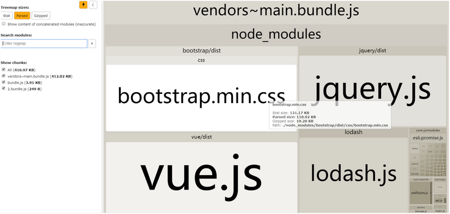

# webpack发布策略

- [编写webpack发布策略的配置文件](#编写webpack发布策略的配置文件)
- [打包图片、字体文件到指定文件夹](#打包图片字体文件到指定文件夹)
- [清理dist文件夹](#清理dist文件夹)
- [分离第三方包到单独文件](#分离第三方包到单独文件)
  - [分离第三方包常用写法](#分离第三方包常用写法)
  - [补充](#补充)
    - [1.bundle分析插件](#1bundle分析插件)
    - [2.将js文件输出到js文件夹](#2将js文件输出到js文件夹)
    - [3.import()动态导入与output.chunkFilename的关系](#3import动态导入与outputchunkFilename的关系)
- [html文件压缩](#html文件压缩)
- [提取CSS到单独文件](#提取CSS到单独文件)
  - [CSS文件压缩](#CSS文件压缩)
  
## 编写webpack发布策略的配置文件
可以指定两份webpack的配置文件，一份用于开发环境（`webpack.prod.js`），一份用于生产环境（`webpack.dev.js`）。  
然后在 `package.json` 中指定不同的 `script` 来打包：   
 ```js
 // package.json

 {
   // ...

   "scripts": {
     "build": "webpack --config webpack.dev.js",
     "build:prod": "webpack --config webpack.prod.js"
   }
   
   // ...
 }
 ```
 > `--config` 参数可以指定webpack使用的配置文件。  

## 打包图片、字体文件到指定文件夹
1. 方法一：直接在 `url-loader` （或 `file-loader`） 的 `name` 属性中指定文件夹  
    ```js
    {
      test: /\.(gif|jpg|jpeg|bmp|png)$/,
      use: {
        loader: 'url-loader',
        options: {
          limit: 10240,  // >=10k不转码
          name: 'images/[hash:8]-[name].[ext]'  // 直接在前面添加文件夹路径即可
        }
      }
    }
    ```
   > 这种方法最简单直接，但是丢失了图片原始的相对src目录的路径。

2. 方法二：使用 `file-loader` 的[配置参数](https://webpack.docschina.org/loaders/file-loader/)（`url-loader` 只是在 `file-loader` 基础上添加了 `limit` 功能，所以同样适用）
   - `context`: 指定上下文所在目录，默认为项目根目录；
   - `outputPath`: 输出文件的路径，**可以定义为一个函数**；
   - `[path]`: 源文件相对于`context` 的路径；
   ```js
   {
     test: /\.(jpg|jpeg|bmp|gif|png)$/,
     use: {
       loader: 'url-loader',
       options: {
         limit: 10240, 
         context: 'src',  // 指定上下文为src目录
         name: '[path][hash:8]-[name].[ext]'  // 相对context（这里为src目录）的路径 + hash:8-name.ext【有相对路径之后hash值可以省略】
         // 这样指定context和name之后，src目录中的图片会保留相对于src目录的路径输出到dist目录， 如src/imgs中的图片会输出到dist/imgs中。
       }
     }
   }
   ```  
   字体文件可能会来自 `node_modules` 中的库（如Bootstrap中的字体文件），并且有时对于字体文件的处理中检测的 `svg` 后缀名会错误地包含了svg图片，此时可以通过 `outputPath` 来修正：  
   ```js
   {
     test: /\.(ttf|eot|woff|woff2|svg)$/,
     use: {
       loader: 'file-loader',
       options: {
         context: 'src',
         name: '[hash:8]-[name].[ext]',
         outputPath: (url, resourcePath, context){
           // `url` 是经过name格式处理之后的文件名
           // `resourcePath` 是源文件的绝对路径
           // `context` 是 context的绝对路径

           // 如果源文件绝对路径中包含了 node_modules ，则直接输出到 fonts目录
           if(/node_modules/.test(resourcePath)){
             return `fonts/${url}`
           }
           // 默认返回文件相对src目录的路径, **这样之后imgs目录下的svg图片就不会输出到fonts目录下了**
           const relativePath = path.relative(context, resourcePath)
           const relativeDir = path.dirname(relativePath)
           return `${relativeDir}/${url}`
         }
       }
     }
   }
   ```

## 清理dist文件夹
webpack打包时不会删除之前的 `/dist` 文件夹，需要安装插件 `clean-webpack-plugin` 来实现打包之前先删除 `/dist` 文件夹。  
安装 `clean-webpack-plugin` ：  
```sh
yarn add clean-webpack-plugin --dev
```  
配置 `clean-webpack-plugin` ：  
```js
// webpack.prod.js

const { CleanWebpackPlugin } = require('clean-webpack-config')

module.exports = {
  // ...
  plugins: [
    new CleanWebpackPlugin(),
    // ...
  ]
  // ...
}
```

## 分离第三方包到单独文件
第三方的包一般不需要改动，可以抽取成单独文件，便于浏览器缓存这些文件。  
webpack4之后分离第三方包使用 [optimization.splitChunks](https://webpack.docschina.org/plugins/split-chunks-plugin/) 代替 `CommonsChunkPlugin`。  
`splitChunks` [默认配置](https://webpack.docschina.org/plugins/split-chunks-plugin/#optimization-splitchunks), 重点配置项如下：
- chunks: 指示哪些代码需要优化
  - 默认为 `async`, 只对按需加载（即使用[import()语法](https://blog.csdn.net/ixygj197875/article/details/79263912)而不是静态import）的模块进行分离；
  - 可以设置为 `initial` 或 `all` 来对所有代码进行优化，二者区别：`all` 模式下不会分开打包异步和非异步模块,而 `initial` 模式下会分开优化打包异步和非异步模块；
- cacheGroups: 自定义配置打包块，会继承/覆盖splitChunks的相应属性
  - 示例写法：  
    ```js  
    cacheGroups: {
      vendors: {
        chunks: 'all',  // 覆盖splitChunks默认的 chunks：'async' 的值
        test: /[\\/]node_modules[\\/]/,  // 抽取所有 /node_modules/ 下的文件
        name: 'vendors',  // 打包时的名称， 注意需要配合 webpack配置中 output.chunkFilename 属性使用,如设置 output.chunkFilename: '[name].bundle.js'
      }
    }
    ```  
    作用是将 `vendors` 中的包打包到单独的文件中。

### 分离第三方包常用写法
最简单的分离方式：  
```js
// webpack.config.js

module.exports = {
  output: {
    // ...
    chunkFilename: '[name].bundle.js'  // 注意添加上这一项，原因见上面介绍
  },
  optimization: {
    splitChunks: {
      chunks: 'all',  // 直接设置 chunks 属性为 'all'/'initial'，splitChunks的默认配置会生成第三方包到单独 vendors~main.bundle.js 中
    }
  }
  
}
```  
更灵活地控制分离文件的方式：  
```js
// webpack.config.js

module.exports = {
  output: {
    // ...
    chunkFilename: '[name].bundle.js'  // 注意添加上这一项，原因见上面介绍
  },
  optimization: {
    splitChunks: {
      cacheGroups: {
        // 覆盖默认配置中的 vendors 组，分离所有 /node_modules/ 的文件为一个 vendors.bundle.js
        vendors: {
          test: /[\\/]node_modules[\\/]/,
          name: 'vendors',
          chunks: 'all'
        },
        // 自定义了一个 commons 组，分离 vue 和 lodash 包为 vueLodash.bundle.js 
        // 注意设置 priority 高于 vendors 组才能生成该文件，且此时 vendors 组不再包含vue和lodash
        commons: {
          test: /[\\/]node_modules[\\/](vue|lodash)[\\/]/,
          name: 'vueLodash',
          chunks: 'all',
          priority: 10,
        }
      }
    }
  }
  
}
```  
### 补充
#### 1.bundle分析插件
`webpack-bundle-analyzer` 插件用图形化的形式展示打包后的模块：  
  
安装插件：  
```sh
yarn add webapck-bundle-analyzer --dev
```
配置插件：  
```js
// webpack.config.js

const BundleAnalyzerPlugin = require('webpack-bundle-analyzer').BundleAnalyzerPlugin

module.exports = {
  plugins: [
    new BundleAnalyzerPlugin({
      analyzerMode: 'static'  // 默认server-打包完成自动启动http服务器展示bundle分析报告，static-生成bundle分析报告HTML文件并打开
    })
  ]
}
```  
#### 2.将js文件输出到js文件夹
直接在 `webpackOptions.output` 中修改 `filename` 和 `chunkFilename` 属性值：  
```js
output: {
  filename: 'js/bundle.js',
  chunkFilename: 'js/[hash:8]-[name].bundle.js'
}
```  

#### 3.import()动态导入与output.chunkFilename的关系
`output.chunkFilename` 指定的是非主入口（entry）chunk文件的命名方式；  
使用 `import()` 语法来动态导入模块可以实现按需加载（懒加载），这些动态导入的模块在webpack打包时会被分离成单独的chunk文件，但是这些文件的默认命名方式是：`[id].bundle.js` ，可读性很差。  
可以通过在 `import()` 中加上注释 `webpackChunkName: "[name]" ` ，同时指定 `chunkFilename` 的方式来解决这个问题，示例如下：   
```js
// webpack.config.js

output: {
  chunkFilename: '[name].bundle.js'
}
```  
```js
// main.js

import(/* webpackChunkName: "lodash" */, 'lodash').then(/* ... */)
```  

## html文件压缩
1. 添加 `html-loader` ：
   ```sh
   yarn add -D html-loader
   ```
2. 添加匹配规则：  
   ```js
   {
     test: /\.html$/,
     use: {
       loader: 'html-loader',
       options: {
         minimize: true,  // 启用html压缩
       }
     }
   }
   ```  

> 从上面的loader规则配置可以看出，loader规则配置时如果需要传入参数，可以给 `use` 属性传入一个包含 `loader`，`options` 属性的对象，  
> 据此，之前配置过的 `url-loader` 可以重写为如下：  

```js
use: {
  loader: 'url-loader',
  options: {
    limit: 20480,  // 限制base64转码的临界值
    name: '[hash:8]-[name].[ext]',  // 指定输出文件的命名格式
  }
}
```

## 提取CSS到单独文件
1. 安装 `mini-css-extract-plugin` :
   ```sh
   yarn add -D mini-css-extract-plugin
   ```
2. 添加到 `plugins` 节点中：  
   ```js
   const MiniCssExtractPlugin = require('mini-css-extract-plugin')

   // ...
   plugins: [
     new MiniCssExtractPlugin({
       // 所有选项都非必填项
       filename: '[hash:8]-[name].css',
       chunkFilename: '[id].css',
     }),
   ],
   // ...

   ```

3. 将 `style-loader` 替换成 `MiniCssExtractPlugin.loader` ：  
   ```js
    // .css
    {
      test: /\.css$/,
      use: [
        MiniCssExtractPlugin.loader,
        'css-loader'
      ]
    },
    // .less
    {
      test: /\.less$/,
      use: [
        MiniCssExtractPlugin.loader,
        'css-loader', 
        'less-loader'
      ]
    },
    // .scss
    { 
      test: /\.scss$/, 
      use: [
        MiniCssExtractPlugin.loader, 
        'css-loader', 
        'sass-loader'
      ] 
    },
   ```  
   > 如果需要将css文件抽取到指定目录(如：输出到 dist/css 文件夹下)，可以通过 `filename` 和 `publicPath` 参数来配置：  
   ```js
   plugins: [
     new MiniCssExtractPlugin({
       //filename: '[hash:8]-[name].css',
       filename: 'css/[hash:8]-[name].css',  // 添加 css/ 路径
       chunkFilename: '[id].css',
     }),
   ],


   // .css
    {
      test: /\.css$/,
      use: [
        {
          loader: MiniCssExtractPlugin.loader,
          options: {
            publicPath: '../'  // 添加 publicPath 来修正 css文件中的图片，字体等文件的路径
          }
        },
        'css-loader'
      ]
    },

   ```

### CSS文件压缩
webpack打包时如果 `mode` 指定是 `production` 则会启用 js压缩，  
但是提取出来的CSS文件不会被压缩，需要手动安装 `optimize-css-assets-webpack-plugin` 进行压缩：  
1. 安装 `optimize-css-assets-webpack-plugin` ：  
   ```sh
   yarn add -D optimize-css-assets-webpack-plugin
   ```
2. 向 `webpack.config.js` 中添加 `optimization` 属性， 指定 `minimizer` 来覆盖默认的压缩器：  
   ```js
   const OptimizeCSSAssetsPlugin = require('optimize-css-assets-webpack-plugin')
   const TerserJSPlugin = require('terser-webpack-plugin')  // webpack默认依赖的压缩器，无需手动安装，只能压缩js文件

   // ...
   optimization: {
      minimizer: [
        new OptimizeCSSAssetsPlugin({}),  // 压缩 提取出来的css文件
        new TerserJSPlugin({
          parallel: true,     // 多核运行
          sourceMap: true     // 如果使用了source-map功能必须设置为true
        }),  // 压缩js文件
      ],
    }
    // ...

   ```
   > 注意： 由于指定的 `minimizer` 会覆盖默认的压缩器，所以需要重新指明 JS压缩器为 `TerserJSPlugin` 并作相应配置（如上面例子中所示），否则js文件将不会被压缩。