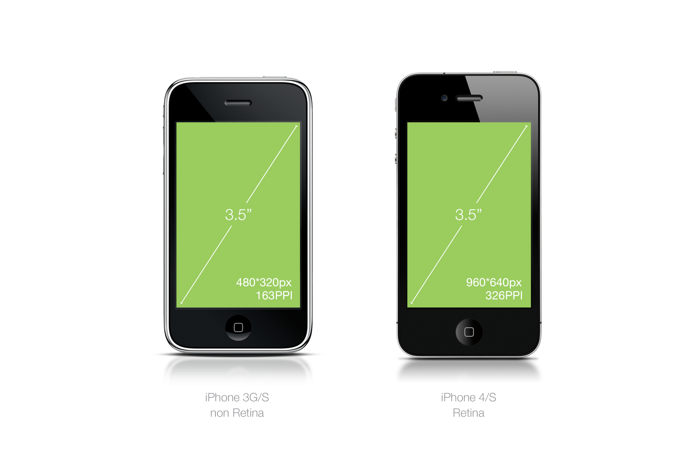
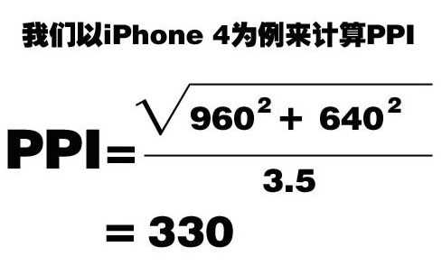

# 移动web开发

## 基础知识

### 屏幕

- 屏幕尺寸：
  - 指的是**屏幕对角线的长度**，一般用 **英寸** 来度量。
- 屏幕分辨率：
  - 屏幕垂直和水平方向的像素数量， 一般用**像素**来度量。

 

如上图所示，iPhone4/S的屏幕尺寸为3.5英寸，分辨率为960px*640px。

另外iPhone3G/S和iPhone4/S都是3.5英寸屏幕，但是分辨率却不一样，可以得出：

>  像素是一个相对长度单位

- 像素密度（PPI）

  - Pixels Per Inch， 每英寸的像素数量。

  - PPI越大，说明单位英寸里面容纳的像素数量越多，画面也就越精致。

  - PPI计算方法：

    


> **[info] 思考**：屏幕尺寸固定时，PPI和像素大小的关系？
>
>  结论： PPI越大，像素实际大小越小。

### 设备独立像素

由于不同的PPI上相同像素的内容显示的实际大小不同，此时需要一个**保证内容在不同PPI设备上显示的实际大小差不过的新单位，这就是独立像素**。 IOS设备上叫PT（point）， 安卓设备上叫DP（device independent pixel）。

像素与独立像素之比可以通过 `window.devicePixelRatio` 获取。

### 像素

**物理像素** 指的是屏幕渲染图像的最小单位，属于物理属性，不可人为改变。**以上讨论的都是物理像素**。

**CSS像素** 指的是CSS进行网页布局渲染时用的单位。

二者关系： CSS像素（PC端）默认值是与物理像素保持一致，但是可以通过缩放导致比例变化。

## 远程调试

- 模拟调试
  - 现代主流浏览器均支持移动开发模拟调试，通常按F12可以调起
- 真机调试
  - 详见[该博客](<https://blog.csdn.net/baidu_27605213/article/details/89226108>)

## 视口（viewport）

视口（viewport) 是用来约束网页顶级元素 `<html>` 的，即 **它决定了html的大小** 。

PC设备上 `viewport` 大小取决于浏览器窗口的大小。

**布局视口（layout viewport)**

浏览器默认设置的viewport（大部分默认为980px）。

**理想视口（ideal viewport）**

理想视口大小为设备的屏幕区域。

### 屏幕适配

移动页面最理想的状态是： 避免滚动条，且不被默认缩放处理。

将`layout viewport` 缩放到 `ideal viewport` 中即可。

可以通过设置`<meta name="viewport" content="">` 来控制和改变浏览器默认的`layout viewport` 的大小。

#### viewport标签详解

```html
<meta name="viewport" content="">
content可能值如下：
width - 设置layout viewport的宽度， 取值可为数值或者 device-width
height - 设置layout viewport的高度， 取值可为数值或者device-height
initial-scale - 设置页面初始缩放值， 取值为数字，可以为小数
maximum-scale - 设置页面最大缩放值
minimum-scale - 设置页面最小缩放值
user-scalable - 是否允许用户进行缩放， 值为 “yes” 或者 “no”
```

> 开发中一般写法： 
>
> ```html
> <meta name="viewport" content="width=devide-width, user-scalable=no, initial-scale=1.0, maximum-scale=1.0, minimum-scale=1.0">
> ```

## 单位

- 百分比

  - ```
    width/height 	- 参照父元素的width/height
    padding/margin 	- 参照父元素的width/height
    border 			- 不支持设置百分比
    ```

- em

  - 相对长度单位，参照当前元素的字号大小

- rem

  - 相对长度单位，参照根元素（html）的字号大小

## 触屏事件

### 事件类型

- touchstart
- touchmove
- touchend

### TouchEvent对象

- touches： 位于屏幕上所有手指的集合
- targetTouches： 当前元素上的所有手指的集合
- changedTouches： touchstart时是刚与屏幕接触的触点的集合，touchend时是刚离开屏幕的触点的集合。

### Touch对象

- clientX/clientY：与屏幕可见区域左上角的距离
- pageX/pageY：与整个页面左上角的距离
- screenX/screenY：与整个页面左上角的距离
- target： 与手指接触的真正对象

> 移动开发时会设置 viewport， 大多数情况下三个距离是一致的。

### 移动端click延迟

移动端click事件会延迟约300ms执行，目的是为了判断用户是否是`double tap` 。

解决方案： 使用移动端触屏事件封装好的一些手势事件来代替click。

存在问题： 点透现象

最佳解决方案： 使用fastclick类库解决click延时，统一使用click事件，这样同时可以在PC端触发事件。

## 移动端类库

### zepto.js

移动端的jquery，用法详见官网文档。

> zepto是分模块的，默认的文件包含 `zepto event ajax form ie` 五个模块，
>
> 如果需要其它模块，需要自行打包：
>
> ```js
> // 编辑 make 文件，找到以下行
> modules = (env['MODULES'] || 'zepto event ajax form ie').split(' ')
> // 添加需要的模块
> // 然后执行命令 npm run-script dist
> // 查看目录dist中即有zepto.js
> ```

### iScroll.js

滚动插件，实现原生滚动效果。

### swiper.js

轮播图插件。

### fastclick.js

解决移动端click延迟的类库。

